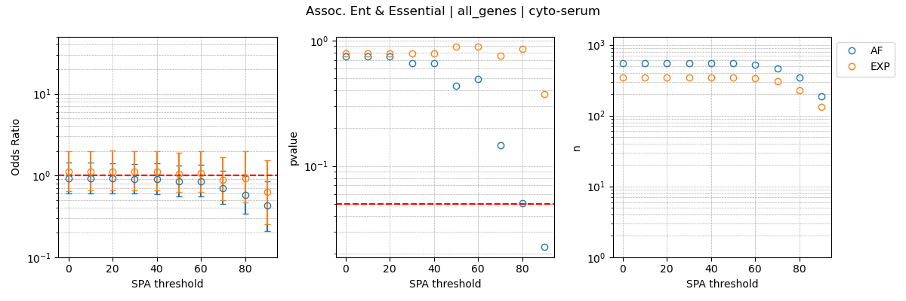

# Association_Native_Entanglements_and_Misfolding  
In this analysis we quantify the association between the presence of native entanglements and being an essential protein determined in the set of high quality knockout studies present in [Deg](https://tubic.org/deg/public/index.php). 

## Fisher exact tests of significant association


### Usage of [EntanglementsAndEssentiality.py](src/data/EntanglementsAndEssentiality.py)
```
usage: EntanglementsAndEssentiality.py [-h] -Ag ALL_GENE_LIST -Eg ENT_GENE_LIST -Esg ESS_GENE_LIST -l LOG_FILE -o OUTPATH -t TAG -b BUFF -s SPA --LiPMScov LIPMSCOV

Process user specified arguments

options:
  -h, --help            show this help message and exit
  -Ag ALL_GENE_LIST, --all_gene_list ALL_GENE_LIST
                        path to all gene list to use
  -Eg ENT_GENE_LIST, --ent_gene_list ENT_GENE_LIST
                        path to ent gene list to use
  -Esg ESS_GENE_LIST, --ess_gene_list ESS_GENE_LIST
                        path to essential gene list to use
  -l LOG_FILE, --log_file LOG_FILE
                        Path to logging file
  -o OUTPATH, --outpath OUTPATH
                        path to output directory. will be made if doesnt exist
  -t TAG, --tag TAG     tag for final output image
  -b BUFF, --buff BUFF  buffer used C CD CG
  -s SPA, --spa SPA     spa used 0, 10, 20, 30, 40, 50, 60, 70, 80, 90
  --LiPMScov LIPMSCOV   LiPMS coverage used 0, 10, 20, 30, 40, 50, 60, 70, 80, 90
```

If you have the [SLUG] then you can use the command files located [here](src/command_lists/EntanglementsAndEssentiality.cmds) to reproduce the Fisher exact test done on both the sets of experimental and alphafold data in this work. 

## Plotting of Fisher exact tests of significant association

### Usage of [Plot_EntanglementsAndEssentiality.py](src/data/Plot_EntanglementsAndEssentiality.py)
```
usage: Plot_EntanglementsAndEssentiality.py [-h] -f INP_FILES -o OUTPATH -t TAG

Process regression data and generate plots.

options:
  -h, --help            show this help message and exit
  -f INP_FILES, --inp_files INP_FILES
                        Input file pattern for regression data.
  -o OUTPATH, --outpath OUTPATH
                        Path to output directory.
  -t TAG, --tag TAG     tag for final output image
```

If you have the [SLUG] then you can use the command files located [here](src/command_lists/Plot_EntanglementsAndEssential.cmds) to reproduce the plotting of the Fisher exact test done on both the sets of experimental and alphafold data in this work. 


## Results
We observe a statisitcally significant positive association between the presence of a native entanglement and being essential  

When considering all observed proteins with atleast 50% coverage in the LiP-MS experiments  

Raw analysis data can be viewed [here](data/entanglement_and_essential_plot_data_all_genes.csv)
