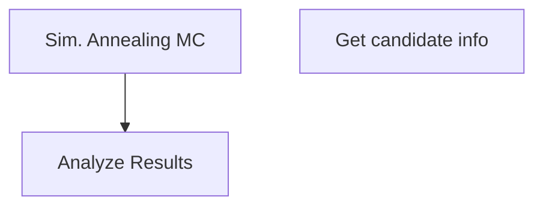
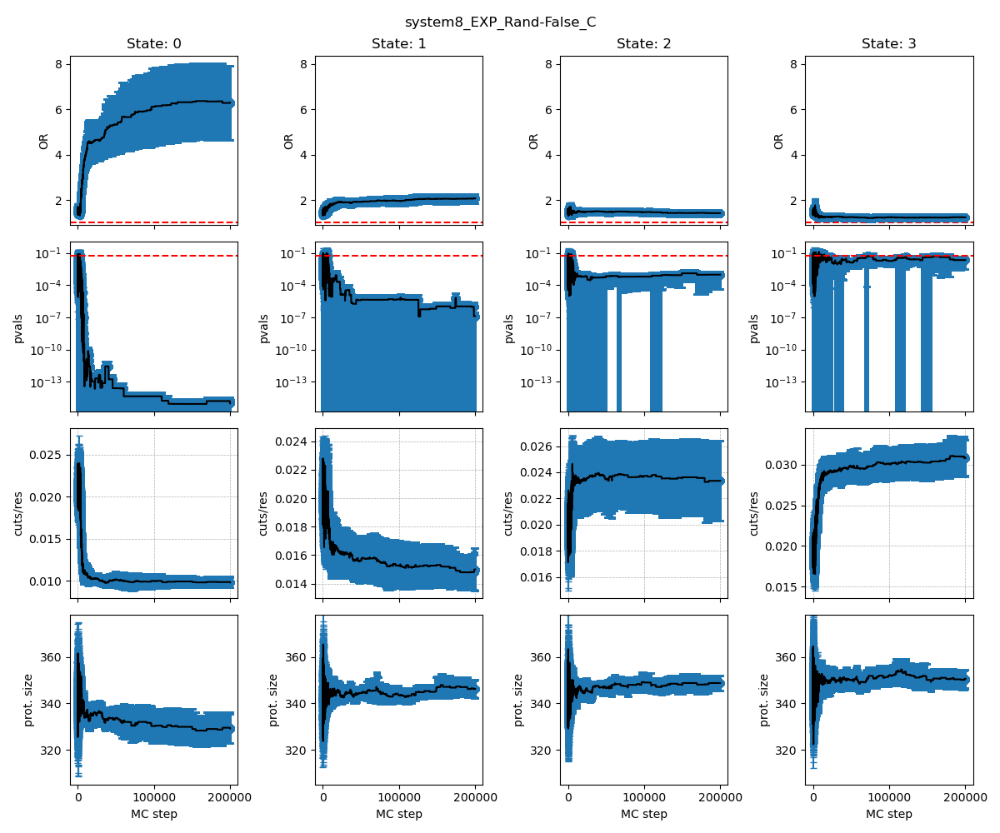
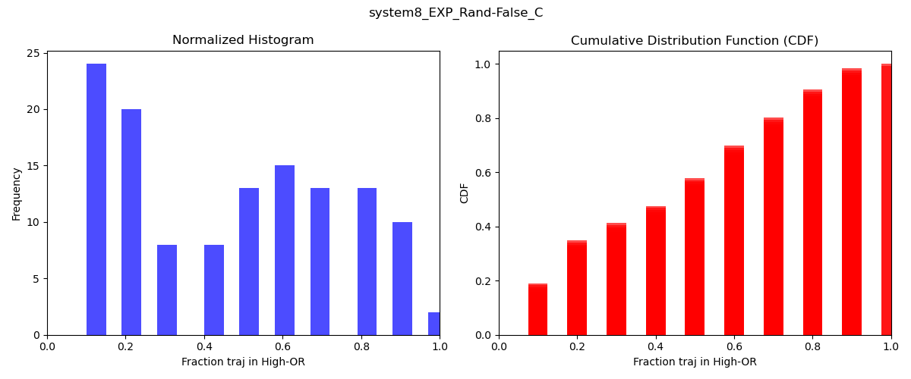
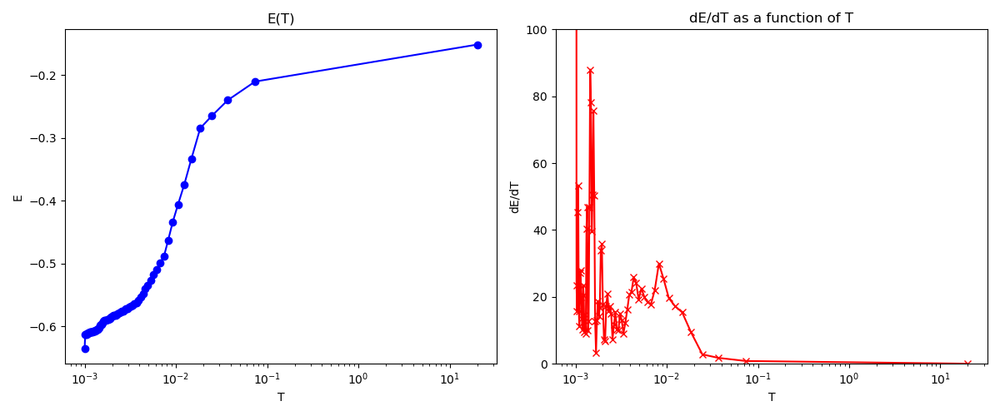
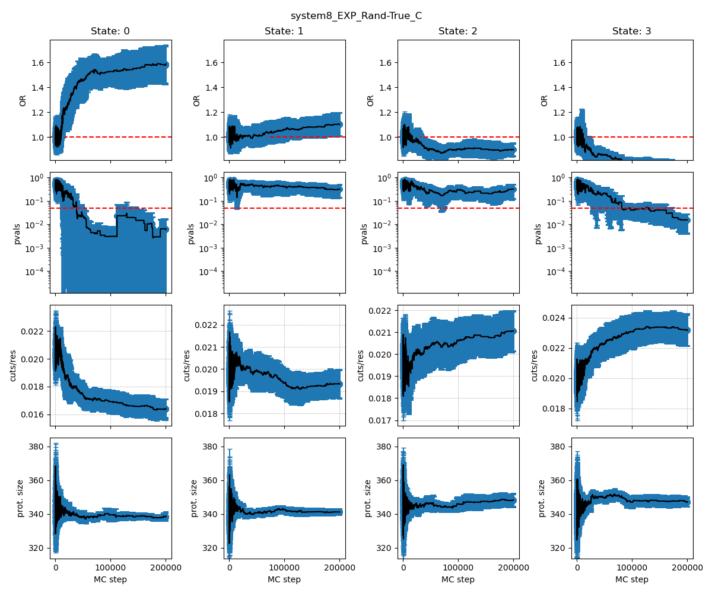
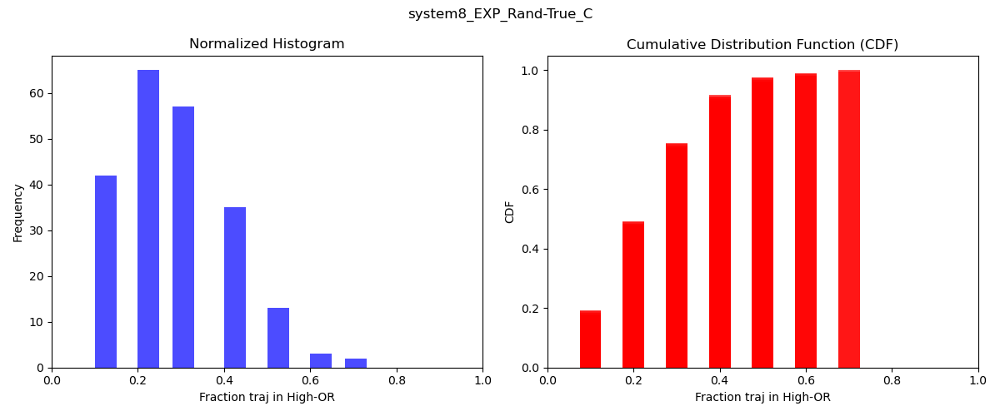
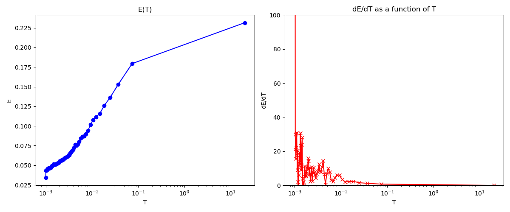

# Candidate_Selection_for_CG_T-quench_Sims  

## General workflow


## Simulated annealing MC for Candidate selection

For a given LiP-MS condition (i.e., *cyto-serum only*, *cyto-serum + DnaK*, or *cyto-serum + GroEL*), proteins that meet the following criteria are randomly distributed amongst four groups. The proteins must:

1. Have at least 50% of their canonical sequence observed in the LiP-MS experiments.
2. Have a sum of their peptide abundance (SPA) greater than the 50th SPA percentile of all proteins in that condition.
3. Be non-refoldable in the absence of chaperones (i.e., have at least 1 significant PK site).

For each group of proteins $ i $, there is an objective function defined as:

$$
E_i = -C_1 \log(\text{OR}_i) + C_2 D_i
$$

Where:
- $ \text{OR}_i $ is the ratio of the odds of misfolding in the entangled region relative to the odds of misfolding in the non-entangled region of the protein group $ i $.
- $ D_i $ is the Kolmogorov–Smirnov test statistic for the protein size distribution and the reference distribution, taken as the superset of all four groups.

One MC step is taken by randomly swapping 5 proteins between each pair of neighboring group indexes. $ C_1 = 1 $ and $ C_2 = 2.5 $ in this work, optimized to ensure penalties for deviations from the reference protein size distribution are balanced by the opportunity to increase the odds ratio.

The **Metropolis criterion** is applied to determine if any given swap is accepted or rejected. The acceptance ratio for a swap between groups $ j $ and $ k $ at MC step $ x $ is defined as:

$$
P \equiv \frac{P_{\text{new}}(j, k, x)}{P_{\text{old}}(j, k, x-1)} \propto e^{-\beta \Delta E} = e^{-\beta (E_{\text{new}} - E_{\text{old}})} = e^{-\beta (E_j^x + E_k^x - E_j^{x-1} - E_k^{x-1})}
$$

The swap is accepted if either $ P \geq 1 $ or $ 1 > P > u $, where $ u $ is a random number sampled from a uniform distribution bounded by $[0, 1]$. $ \beta $ is an inverse temperature scaling factor that starts very low at 0.05 to allow ample room for the simulation to explore the objective function landscape, scaling linearly to 1000 after every 750 MC steps and remains constant at 1000 thereafter.

Plots of the energy derivative as a function of temperature show a clear phase transition over this window [here](Figures/Rand-False/EXP/PhaseT_system8_EXP_Rand-False_C.png).

## Simulation Details
- In total, 10 independent trajectories are run for the set of proteins with native entanglements likely to be non-refoldable.
- A parallel set of 10 independent simulations was run with a randomized proteome sample, where the significant PK cut-sites are distributed randomly across the proteome. This set acts as a randomized control to measure the inherent shuffling of noise in these simulations.

## Candidate Selection
Candidates predicted to be highly likely to misfold involving their native entanglement were selected by rank ordering the proteins by their fractional presence in the group with the largest OR at the end of each trajectory:

$$
f_M \geq 0.7
$$

The largest OR group is defined as the group with the highest mean OR over the last 10 frames of the trajectory.

### Usage of [Optimizer_SimulatedAnnealing.py](src/data/Optimizer_SimulatedAnnealing.py)
```
usage: Optimizer_SimulatedAnnealing.py [-h] -f RESFEAT_FILES -o OUTPATH --ent_gene_list ENT_GENE_LIST --nonRefold_gene_list NONREFOLD_GENE_LIST -t TAG -b BUFFER -s SPA -c COV -n N_GROUPS -r
                                       REG_FORMULA --random RANDOM -l LOG [--restart_path RESTART_PATH] --steps STEPS -C1 C1 -C2 C2 -C3 C3 -beta BETA -linearT LINEART

Process user specified arguments

options:
  -h, --help            show this help message and exit
  -f RESFEAT_FILES, --resFeat_files RESFEAT_FILES
                        Path to residue feature files
  -o OUTPATH, --outpath OUTPATH
                        Path to output directory
  --ent_gene_list ENT_GENE_LIST
                        Path to gene list to use of entangled proteins
  --nonRefold_gene_list NONREFOLD_GENE_LIST
                        Path to gene list to use of non-refoldable proteins
  -t TAG, --tag TAG     Tag for output filenames
  -b BUFFER, --buffer BUFFER
                        Buffer system to use
  -s SPA, --spa SPA     SPA threshold
  -c COV, --cov COV     LiPMS cov threshold
  -n N_GROUPS, --n_groups N_GROUPS
                        number of groups to optimize
  -r REG_FORMULA, --reg_formula REG_FORMULA
                        Regression formula
  --random RANDOM       Randomize dataset
  -l LOG, --log LOG     Path to logging file
  --restart_path RESTART_PATH
                        Path to a folder containing files to restart from
  --steps STEPS         Number of steps to run
  -C1 C1                C1 coefficient for optimization function
  -C2 C2                C2 coefficient for optimization function
  -C3 C3                C3 coefficient for optimization function
  -beta BETA            Starting beta. If >= 1000 then no temperature quenching is done
  -linearT LINEART      use a linear T scale instead of a linear beta value
```

If you have the [SLUG] then you can use the command files located [here](src/comman_lists/Optimizer_SimulatedAnnealing_wCutControl_system8.cmds) to reproduce simulated annealing used in this work for the experimental data set and for the randomized controls. Please modify any other pathing as necessary. 

## Analysis of simulated annealingg MC trajectories
### Usage of [Analyze_Optimizer_SimulatedAnnealing.py](src/data/Analyze_Optimizer_SimulatedAnnealing.py)
```
usage: Analyze_Optimizer_SimulatedAnnealing.py [-h] -i INPDIR -o OUTPATH -t TAG -l LOG -f RESFEAT_FILES -r REG_FORMULA

Process user specified arguments

options:
  -h, --help            show this help message and exit
  -i INPDIR, --inpdir INPDIR
                        Path to top level directory containing trajectories
  -o OUTPATH, --outpath OUTPATH
                        Path to output directory
  -t TAG, --tag TAG     Tag for output filenames
  -l LOG, --log LOG     Path to logging file
  -f RESFEAT_FILES, --resFeat_files RESFEAT_FILES
                        Path to residue feature files
  -r REG_FORMULA, --reg_formula REG_FORMULA
                        Regression formula
```

### Results of simulated annealing
#### Experimental dataset cyto-serum only
  
  
  
Data for these plots can be found [here](data/Rand-False/EXP/)  

#### Experimental dataset cyto-serum only (Radomized)
  
  
  
Data for these plots can be found [here](data/Rand-True/EXP/)  

## Getting info for final refolded and misfolded candidates 
Here we randomly select 10 of the [refolded candidates](../Processing_LiP-MS_data/data/Refolded/EXP_all/ALL_Refolded.csv) and then select 10 candidates that most closely match the size distribution from those [misfolded candidates](data/Rand-False/EXP/Fract_High-OR_Cdists_system8_EXP_Rand-False_C.csv) that were present in the highest OR state atleast 70% of the time.  

### Usage of [Get_Candidate_info.py](src/data/Get_Candidate_info.py)
```
usage: Get_Candidate_info.py [-h] -r REFOLDED -o OUTPATH -m MISFOLDED -l LOG -e ENT_FEATURES -f RES_FEATURES

Process user specified arguments

options:
  -h, --help            show this help message and exit
  -r REFOLDED, --refolded REFOLDED
                        Path to top refolded gene file
  -o OUTPATH, --outpath OUTPATH
                        Path to output directory
  -m MISFOLDED, --misfolded MISFOLDED
                        path to misfolded genes cdf file
  -l LOG, --log LOG     Path to logging file
  -e ENT_FEATURES, --ent_features ENT_FEATURES
                        path to unique ent feature file
  -f RES_FEATURES, --res_features RES_FEATURES
                        path to residue feature files
``` 
If you have the [SLUG] then you can use the command files located [here](src/comman_lists/Get_Candidate_info.cmds) to get the candidate info. Since the 10 refolded proteins are randomly selected results may change. Please modify any other pathing as necessary. 

The final set of candidates selected can be found [here](data/Simulation_candidate_summary.xlsx). You can also find the raw files [here](data/Get_Candidate_info/)  
There are three groups of candidates:  
1. Matched_refolded - are proteins that were observed to be refolded in the absence of chaperones in the LiPMS experiments.  
2. Matched_misfolded - are proteins that were in the highest OR states in atleast 70% of the the Monte Carlo Annealing simulation trjaectories and matched to the size distribution of the refolded set.  
3. UnMatched_misfolded - is a random set of 10 proteins that were in the highest OR states in atleast 70% of the the Monte Carlo Annealing simulation trjaectories.  (picked to be representative of the proteome size distribution)  