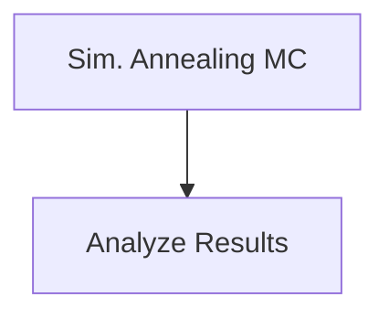

# Candidate_Selection_for_CG_T-quench_Sims  

## General workflow


## Simulated annealing MC for Candidate selection

### Usage of [Optimizer_SimulatedAnnealing.py](src/data/Optimizer_SimulatedAnnealing.py)
```
usage: Optimizer_SimulatedAnnealing.py [-h] -f RESFEAT_FILES -o OUTPATH --ent_gene_list ENT_GENE_LIST --nonRefold_gene_list NONREFOLD_GENE_LIST -t TAG -b BUFFER -s SPA -c COV -n N_GROUPS -r
                                       REG_FORMULA --random RANDOM -l LOG [--restart_path RESTART_PATH] --steps STEPS -C1 C1 -C2 C2 -C3 C3 -beta BETA -linearT LINEART

Process user specified arguments

options:
  -h, --help            show this help message and exit
  -f RESFEAT_FILES, --resFeat_files RESFEAT_FILES
                        Path to residue feature files
  -o OUTPATH, --outpath OUTPATH
                        Path to output directory
  --ent_gene_list ENT_GENE_LIST
                        Path to gene list to use of entangled proteins
  --nonRefold_gene_list NONREFOLD_GENE_LIST
                        Path to gene list to use of non-refoldable proteins
  -t TAG, --tag TAG     Tag for output filenames
  -b BUFFER, --buffer BUFFER
                        Buffer system to use
  -s SPA, --spa SPA     SPA threshold
  -c COV, --cov COV     LiPMS cov threshold
  -n N_GROUPS, --n_groups N_GROUPS
                        number of groups to optimize
  -r REG_FORMULA, --reg_formula REG_FORMULA
                        Regression formula
  --random RANDOM       Randomize dataset
  -l LOG, --log LOG     Path to logging file
  --restart_path RESTART_PATH
                        Path to a folder containing files to restart from
  --steps STEPS         Number of steps to run
  -C1 C1                C1 coefficient for optimization function
  -C2 C2                C2 coefficient for optimization function
  -C3 C3                C3 coefficient for optimization function
  -beta BETA            Starting beta. If >= 1000 then no temperature quenching is done
  -linearT LINEART      use a linear T scale instead of a linear beta value
```

If you have the [SLUG] then you can use the command files located [here](src/comman_lists/Optimizer_SimulatedAnnealing_wCutControl_system8.cmds) to reproduce simulated annealing used in this work for the experimental data set and for the randomized controls. Please modify any other pathing as necessary. 


### Results of simulated annealing
#### Experimental dataset cyto-serum only
  
  
  
Data for these plots can be found [here](data/Rand-False/EXP/)  

#### Experimental dataset cyto-serum only (Radomized)
  
  
  
Data for these plots can be found [here](data/Rand-True/EXP/)  