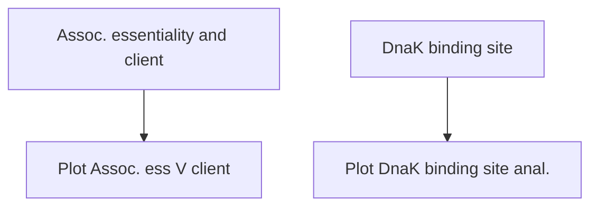
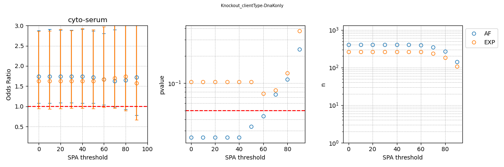
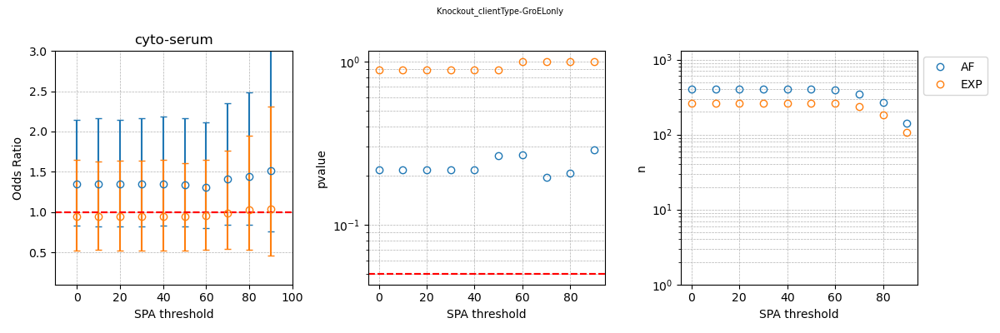

# Chaperone_Client_Associations  
Here we asses the statistical association known DnaK and GroEL clients with gene essentiality and native entanglemnts. We collate together a set of client proteins from experiments that directly measure the association of a given protein with either DnaK or GroEL either via co-immunoprecipitaton or his-tag purification followed by proteomics methods for identification. 

## General workflow


## Association of gene essentiality and client status
We use the Fisher exact test to determine if there is any statistically significant associaiton between proteins being essential and a chaperone client. 
The contingency table is designed as follows:  
| | Client Yes | Client No 
|------|-----------|----------------|
| Essential & Ent. | | |
| Nonessential & Ent. | | |

### Usage of [Assoc_Client_n_Essential.py](src/data/Assoc_Client_n_Essential.py)
```
usage: Assoc_Client_n_Essential.py [-h] -Ag GENE_LIST -Eg ESS_GENE_LIST -Entg ENT_GENE_LIST -c CLIENT_GENE_LIST -l LOG_FILE -o OUTPATH -t TAG -b BUFF -s SPA --LiPMScov LIPMSCOV

Process user specified arguments

options:
  -h, --help            show this help message and exit
  -Ag GENE_LIST, --gene_list GENE_LIST
                        path to all gene list to use
  -Eg ESS_GENE_LIST, --ess_gene_list ESS_GENE_LIST
                        path to essential gene list to use
  -Entg ENT_GENE_LIST, --ent_gene_list ENT_GENE_LIST
                        path to ent gene list to use
  -c CLIENT_GENE_LIST, --client_gene_list CLIENT_GENE_LIST
                        path to list of genes that are known clients
  -l LOG_FILE, --log_file LOG_FILE
                        Path to logging file
  -o OUTPATH, --outpath OUTPATH
                        path to output directory. will be made if doesnt exist
  -t TAG, --tag TAG     tag for final output image
  -b BUFF, --buff BUFF  buffer used C CD CG
  -s SPA, --spa SPA     spa used 0, 10, 20, 30, 40, 50, 60, 70, 80, 90
  --LiPMScov LIPMSCOV   LiPMS coverage used 0, 10, 20, 30, 40, 50, 60, 70, 80, 90
```

If you have the [SLUG] then you can use the command files located [here](src/command_lists/Assoc_Client_n_Essential.cmds) to reproduce the Fisher exact test used in this work to determine the association between protein essentiality and client state in the experimental data set and the AlphaFold structures. Please modify any other pathing as necessary. 

### Usage of [Plot_Assoc_Client_n_Essential.py](src/data/Plot_Assoc_Client_n_Essential.py)
```
usage: Plot_Assoc_Client_n_Essential.py [-h] -f INP_FILES -o OUTPATH -t TAG

Process regression data and generate plots.

options:
  -h, --help            show this help message and exit
  -f INP_FILES, --inp_files INP_FILES
                        Input file pattern for regression data.
  -o OUTPATH, --outpath OUTPATH
                        Path to output directory.
  -t TAG, --tag TAG     tag for final output image
```
If you have the [SLUG] then you can use the command files located [here](src/command_lists/Plot_Assoc_Client_n_Essential.cmds) to plot the results for both the experimental and Alphafold datasets used in this work. Please modify any other pathing as necessary. 

### Results of Fisher exact test for association of gene essentiality and client status
For the association between protein essentiality and client status DnaK   

[raw plot data](data/Assoc_Client_n_Essential/Assoc_Client_n_Essential_plot_data_Knockout_clientType-DnaKonly.csv)  
 
For the association between protein essentiality and client status GroEL   
  
[raw plot data](data/Assoc_Client_n_Essential/Assoc_Client_n_Essential_plot_data_Knockout_clientType-GroELonly.csv)  


## Presence of DnaK Binding sites in entangled regions  
To determine if there is an enrichment of DnaK binding sites in entangled portions of essential proteins driving our results we did a brute force scan of each FASTA sequence for known DnaK binding motifs [CITE PAPERS FOR BUKAU, Schymkowitz]
| Position | Bukau4        | Emperical4            | Bukau5        | Emperical5              | Schymkowitz             |
|----------|---------------|-----------------------|---------------|-------------------------|-------------------------|
| 0        | R, K          | R, K, H               | R, K          | R, K, H                 | K, E, Q, W, Y            |
| 1        | I, L, V, F, Y | I, L, V, F, Y, A, M, W| I, L, V, F, Y | I, L, V, F, Y, A, M, W  | F, I, K, L, R, V, Y      |
| 2        | I, L, V, F, Y | I, L, V, F, Y, A, M, W| I, L, V, F, Y | I, L, V, F, Y, A, M, W  | F, L, R, V, W, Y         |
| 3        | I, L, V, F, Y | I, L, V, F, Y, A, M, W| I, L, V, F, Y | I, L, V, F, Y, A, M, W  | I, L, M, T, V            |
| 4        | I, L, V, F, Y | I, L, V, F, Y, A, M, W| I, L, V, F, Y | I, L, V, F, Y, A, M, W  | F, L, M, P, R, V, Y      |
| 5        | R, K          | R, K, H               | I, L, V, F, Y | I, L, V, F, Y, A, M, W  | F, I, L, W, Y            |
| 6        | -             | -                     | R, K          | R, K, H                 | F, N, P, R, Y            |

We scan the for the full motif as well as partial motifs that maintain the hydrophobic core either the left flanking basic residues (LF) or right flanking basic residues (RF).

### Usage of [Dnak_simple_motif_scan.py](src/data/Dnak_simple_motif_scan.py)
```
usage: Dnak_simple_motif_scan.py [-h] -o OUTPATH -f FASTA_DIR -c CLUSTERED_ENT_DIR -r REP_GENES_FILE -Eg ESS_GENES_FILE -NEg NONESS_GENES_FILE -b BUFF -s SPA

Process user specified arguments

options:
  -h, --help            show this help message and exit
  -o OUTPATH, --outpath OUTPATH
                        Path to output directory
  -f FASTA_DIR, --fasta_dir FASTA_DIR
                        Path to gene lists to use
  -c CLUSTERED_ENT_DIR, --clustered_ent_dir CLUSTERED_ENT_DIR
                        Tag for output filenames
  -r REP_GENES_FILE, --rep_genes_file REP_GENES_FILE
                        Load style (True: load by gene, False: load a single file with all genes present)
  -Eg ESS_GENES_FILE, --Ess_genes_file ESS_GENES_FILE
                        Path to the Essential genes list
  -NEg NONESS_GENES_FILE, --NonEss_genes_file NONESS_GENES_FILE
                        Path to the NonEssential genes list
  -b BUFF, --buff BUFF  buffer: C CD CG
  -s SPA, --spa SPA     spa; 0 10 20 30 ... 90
```

If you have the [SLUG] then you can use the command files located [here](src/command_lists/Dnak_simple_motif_scan.cmds) to reproduce the scan of DnaK binding motifs used in this work to determine the association between protein essentiality and client state in the experimental data set and the AlphaFold structures. Please modify any other pathing as necessary. 

### Usage of [Plot_Dnak_simple_motif_scan.py](src/data/Plot_Dnak_simple_motif_scan.py)
```
usage: Plot_Dnak_simple_motif_scan.py [-h] -f INP_FILES -o OUTPATH -t TAG

Process regression data and generate plots.

options:
  -h, --help            show this help message and exit
  -f INP_FILES, --inp_files INP_FILES
                        Input file pattern for DnaK binder data
  -o OUTPATH, --outpath OUTPATH
                        Path to output directory.
  -t TAG, --tag TAG     Tag for output filenames.
```
If you have the [SLUG] then you can use the command files located [here](src/command_lists/Plot_Dnak_simple_motif_scan.cmds) to plot the results for both the experimental and Alphafold datasets used in this work. Please modify any other pathing as necessary. 

### Results of DnaK binding site scans
| Motif        | Structure type | Figure                                                                                     |
|--------------|----------------|--------------------------------------------------------------------------------------------|
| Bukau4       | AF             | [Bukau4_ENTonly-True_AF.png](Figures/Dnak_simple_motif_scan/Bukau4_ENTonly-True_AF.png)     |
| Bukau4LF     | AF             | [Bukau4LF_ENTonly-True_AF.png](Figures/Dnak_simple_motif_scan/Bukau4LF_ENTonly-True_AF.png) |
| Bukau4RF     | AF             | [Bukau4RF_ENTonly-True_AF.png](Figures/Dnak_simple_motif_scan/Bukau4RF_ENTonly-True_AF.png) |
| Bukau5       | AF             | [Bukau5_ENTonly-True_AF.png](Figures/Dnak_simple_motif_scan/Bukau5_ENTonly-True_AF.png)     |
| Bukau5LF     | AF             | [Bukau5LF_ENTonly-True_AF.png](Figures/Dnak_simple_motif_scan/Bukau5LF_ENTonly-True_AF.png) |
| Bukau5RF     | AF             | [Bukau5RF_ENTonly-True_AF.png](Figures/Dnak_simple_motif_scan/Bukau5RF_ENTonly-True_AF.png) |
| Schymkowitz  | AF             | [Schymkowitz_ENTonly-True_AF.png](Figures/Dnak_simple_motif_scan/Schymkowitz_ENTonly-True_AF.png) |
| Emperical4   | AF             | [Emperical4_ENTonly-True_AF.png](Figures/Dnak_simple_motif_scan/Emperical4_ENTonly-True_AF.png) |
| Emperical4LF | AF             | [Emperical4LF_ENTonly-True_AF.png](Figures/Dnak_simple_motif_scan/Emperical4LF_ENTonly-True_AF.png) |
| Emperical4RF | AF             | [Emperical4RF_ENTonly-True_AF.png](Figures/Dnak_simple_motif_scan/Emperical4RF_ENTonly-True_AF.png) |
| Emperical5   | AF             | [Emperical5_ENTonly-True_AF.png](Figures/Dnak_simple_motif_scan/Emperical5_ENTonly-True_AF.png) |
| Emperical5LF | AF             | [Emperical5LF_ENTonly-True_AF.png](Figures/Dnak_simple_motif_scan/Emperical5LF_ENTonly-True_AF.png) |
| Emperical5RF | AF             | [Emperical5RF_ENTonly-True_AF.png](Figures/Dnak_simple_motif_scan/Emperical5RF_ENTonly-True_AF.png) |
| Bukau4       | EXP            | [Bukau4_ENTonly-True_EXP.png](Figures/Dnak_simple_motif_scan/Bukau4_ENTonly-True_EXP.png)   |
| Bukau4LF     | EXP            | [Bukau4LF_ENTonly-True_EXP.png](Figures/Dnak_simple_motif_scan/Bukau4LF_ENTonly-True_EXP.png) |
| Bukau4RF     | EXP            | [Bukau4RF_ENTonly-True_EXP.png](Figures/Dnak_simple_motif_scan/Bukau4RF_ENTonly-True_EXP.png) |
| Bukau5       | EXP            | [Bukau5_ENTonly-True_EXP.png](Figures/Dnak_simple_motif_scan/Bukau5_ENTonly-True_EXP.png)   |
| Bukau5LF     | EXP            | [Bukau5LF_ENTonly-True_EXP.png](Figures/Dnak_simple_motif_scan/Bukau5LF_ENTonly-True_EXP.png) |
| Bukau5RF     | EXP            | [Bukau5RF_ENTonly-True_EXP.png](Figures/Dnak_simple_motif_scan/Bukau5RF_ENTonly-True_EXP.png) |
| Schymkowitz  | EXP            | [Schymkowitz_ENTonly-True_EXP.png](Figures/Dnak_simple_motif_scan/Schymkowitz_ENTonly-True_EXP.png) |
| Emperical4   | EXP            | [Emperical4_ENTonly-True_EXP.png](Figures/Dnak_simple_motif_scan/Emperical4_ENTonly-True_EXP.png) |
| Emperical4LF | EXP            | [Emperical4LF_ENTonly-True_EXP.png](Figures/Dnak_simple_motif_scan/Emperical4LF_ENTonly-True_EXP.png) |
| Emperical4RF | EXP            | [Emperical4RF_ENTonly-True_EXP.png](Figures/Dnak_simple_motif_scan/Emperical4RF_ENTonly-True_EXP.png) |
| Emperical5   | EXP            | [Emperical5_ENTonly-True_EXP.png](Figures/Dnak_simple_motif_scan/Emperical5_ENTonly-True_EXP.png) |
| Emperical5LF | EXP            | [Emperical5LF_ENTonly-True_EXP.png](Figures/Dnak_simple_motif_scan/Emperical5LF_ENTonly-True_EXP.png) |
| Emperical5RF | EXP            | [Emperical5RF_ENTonly-True_EXP.png](Figures/Dnak_simple_motif_scan/Emperical5RF_ENTonly-True_EXP.png) |

[Raw plot data EXP](data/Dnak_simple_motif_scan/consolidated_Dnak_binding_data_EXP.csv)
[Raw plot data AF](data/Dnak_simple_motif_scan/consolidated_Dnak_binding_data_AF.csv)