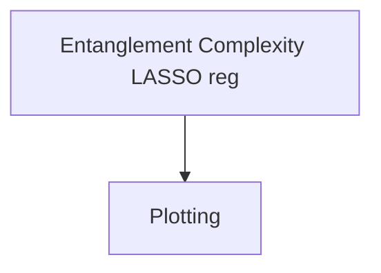
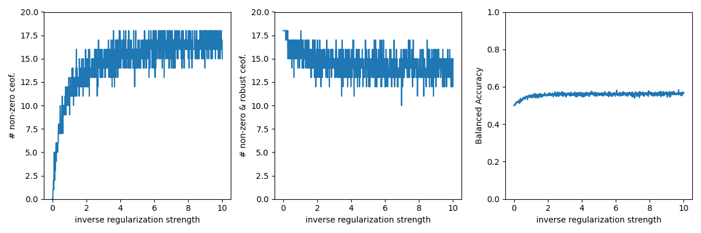
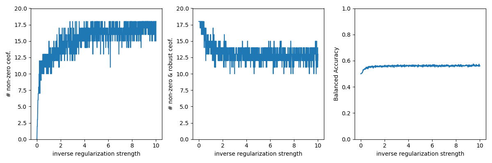
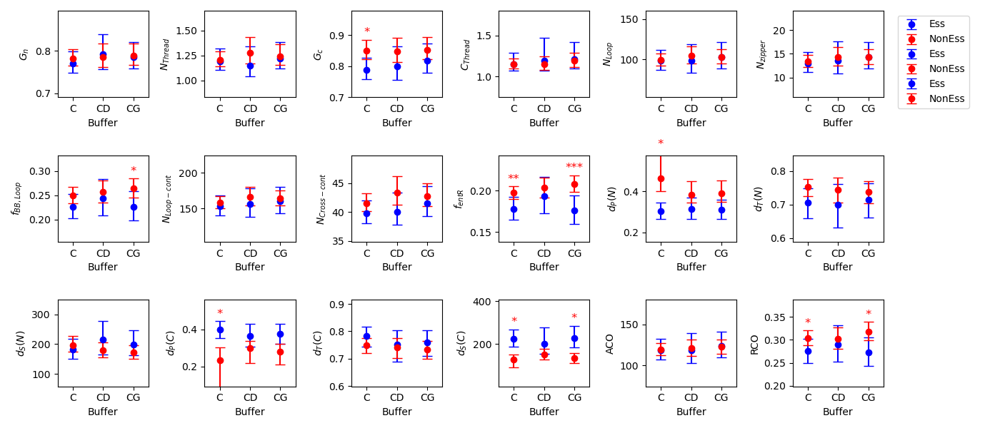
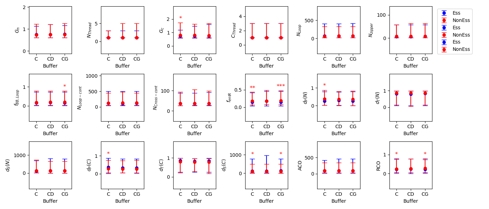
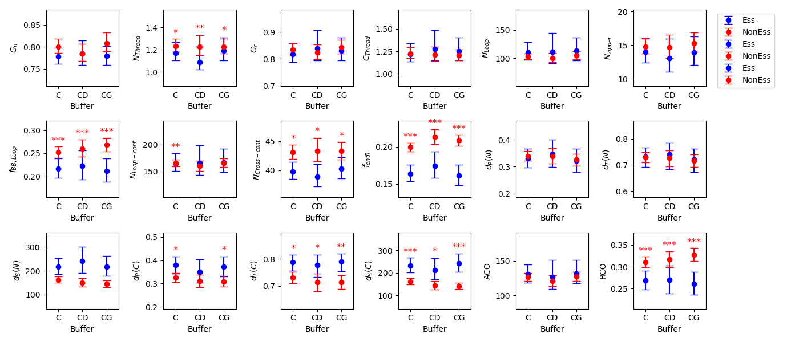
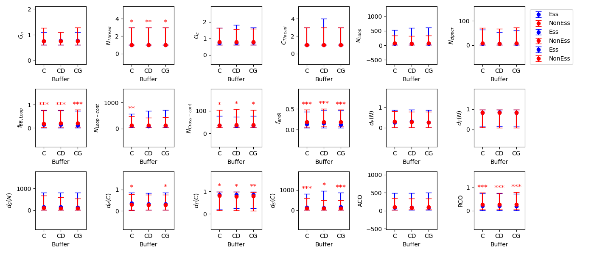

# Entanglement_Topological_Complexity_and_Discrimination  
Here we examine a set of set of [topological complexity measures](docs/entanglement_complexity_metrics.jpg) of the unique entanglements across the sets of essential and nonessential proteins.


## General workflow


## Entanglement Topological Complexity in LASSO Regression

### Usage of [Compare_ent_complexity_metrics.py](src/data/Compare_ent_complexity_metrics.py)
```
usage: Compare_ent_complexity_metrics.py [-h] -Eg ESS_GENE_LIST -NEg NONESS_GENE_LIST -l LOG_FILE -e UENT_FILES -o OUTPATH -p NUM_PERMUTE -b BUFFER -s SPA

Process user specified arguments

options:
  -h, --help            show this help message and exit
  -Eg ESS_GENE_LIST, --Ess_gene_list ESS_GENE_LIST
                        path to Essential gene list used for mask in Fc_ab and FcG_ab calcs
  -NEg NONESS_GENE_LIST, --NonEss_gene_list NONESS_GENE_LIST
                        path to Non-Essential gene list used for mask in Fc_ab and FcG_ab calcs
  -l LOG_FILE, --log_file LOG_FILE
                        Path to logging file
  -e UENT_FILES, --uent_files UENT_FILES
                        path to unique entanglement files
  -o OUTPATH, --outpath OUTPATH
                        path to output directory. will be made if doesnt exist
  -p NUM_PERMUTE, --num_permute NUM_PERMUTE
                        Number of permutations
  -b BUFFER, --buffer BUFFER
                        Buffer system to use
  -s SPA, --spa SPA     SPA threshold
```

If you have the [SLUG] then you can use the command files located [here](src/command_lists/Compare_ent_complexity_metrics.cmds) to reproduce the LASSO regression used in this work to determine the association between protein essentiality and client state in the experimental data set and the AlphaFold structures. Please modify any other pathing as necessary. 

### Usage of [Plot_complexity_metrics.py](src/data/Plot_complexity_metrics.py)
```
usage: Plot_complexity_metrics.py [-h] -m MERGED_FILES -l LOG_FILE -o OUTPATH -s STAT_TYPE

Process user specified arguments

options:
  -h, --help            show this help message and exit
  -m MERGED_FILES, --merged_files MERGED_FILES
                        path to merged stats file
  -l LOG_FILE, --log_file LOG_FILE
                        Path to logging file
  -o OUTPATH, --outpath OUTPATH
                        path to output directory. will be made if doesnt exist
  -s STAT_TYPE, --stat_type STAT_TYPE
                        mean or median to use in plots
```

If you have the [SLUG] then you can use the command files located [here](src/command_lists/Plot_Compare_ent_complexity_metrics.cmds) to plot the comparisons of the complexity metrics used in this work to determine the association between protein essentiality and client state in the experimental data set and the AlphaFold structures. Please modify any other pathing as necessary. 

### Results
LASSO regression scan of inverse regularization strength for the cyto-serum only sample (Experimental results)  

  
LASSO regression scan of inverse regularization strength for the cyto-serum only sample (Alphafold results)  

  
  
Comparing the entanglement complexity metric distribution means (Experimental results)  


Comparing the entanglement complexity metric distribution medians (Experimental results)  

  
  
Comparing the entanglement complexity metric distribution means (Alphafold results)  


Comparing the entanglement complexity metric distribution medians (Alphafold results)  
