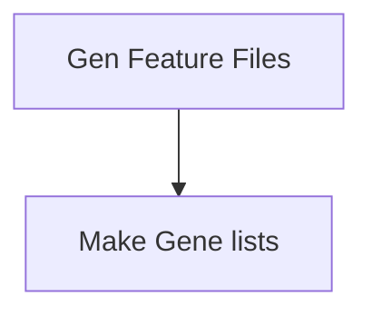

# Make_Protein_Feature_Files   
This analysis generates a feature file for each protein in your dataset and then makes lists of genes to use in further analysis.

## General workflow


## Generate Feature Files
Here we collate information from various databases to make the set of feature files.
[SCOP](https://www.ebi.ac.uk/pdbe/scop/)
[DEG](http://origin.tubic.org/deg/public/index.php)
[DisProt](https://disprot.org/)

### Usage of [Gen_proteome_features.py](src/data/Gen_proteome_features.py)
```
usage: Gen_proteome_features.py [-h] -f CONTROL_FILE -o OUTPATH -u UNIPROT_ID -p PDB_ID -c CHAIN -l LOG_FILE -m LIPMS_FILES -s SKIP_CONTACT_LIB

Process user specified arguments

options:
  -h, --help            show this help message and exit
  -f CONTROL_FILE, --control_file CONTROL_FILE
                        Path to control file.
  -o OUTPATH, --outpath OUTPATH
                        path to outdir
  -u UNIPROT_ID, --uniprot_id UNIPROT_ID
                        Uniprot Ascession ID
  -p PDB_ID, --pdb_id PDB_ID
                        PDB ID to process
  -c CHAIN, --chain CHAIN
                        Chain of the PDB to use
  -l LOG_FILE, --log_file LOG_FILE
                        Path to logging file
  -m LIPMS_FILES, --lipms_files LIPMS_FILES
                        Path to lipms files to use
  -s SKIP_CONTACT_LIB, --skip_contact_lib SKIP_CONTACT_LIB
                        True: skip contact lib generation | False: do not skip
```
The control file has the following format.

```
pdb_dir = path-to-slug/Native_Entanglements_in_PDBs/Representative_experimental_structures/Ecoli/PDBs/ 
mapping_dir = path-to-slug/Native_Entanglements_in_PDBs/Representative_experimental_structures/Ecoli/PDBs/
clustered_ent_files = path-to-slug/Native_Entanglements_in_PDBs/Entanglements/Ecoli/EXP/mapped_NoSlipKNots_clustered_GE/
scope_defs_file = data/cop-cla-defs.txt
scope_file = data/cop-cla-latest.txt
essential_genes_file = data/deg_annotation_p.csv
path_to_disprot = data/DisProt_release_2023_12_with_ambiguous_evidences.tsv
path_to_contact_pt = data/*_contact_potential.csv
```
| key | description |
|----------|----------|
| pdb_dir   | path to PDB directory   |
| mapping_dir    | path to mapping directory  |
| clustered_ent_files | path to clustered entanglments files |
| path_to_contact_pt | path to contact potentials |
| scope_defs_file | path to SCOP definition file |
| scope_file | path to SCOP data file |
| essential_genes_file | path to Deg database file |
| path_to_disprot | path to DisProt database file |


If you have the [SLUG] then you can use the command files located [here](src/command_lists/Gen_proteome_features_EXP_FLiPPR.cmds) to reproduce the features files used in this work for the experimental structures and [here](src/command_lists/Gen_proteome_features_AF_FLiPPR.cmds) for the AlphaFold structures. Please modify any other pathing as necessary. 


## Generate Gene Lists for all other analysis
Here we generate all lists of genes used in this analysis by applying all combinations of several thresholds to the Feature Files.
1. We threshold the Sum of the Peptide Abundance (SPA) for each protein observed in the original Limited Proteolysis Mass Spec (LiP-MS) experiments native samples in 10-percentile incriments along the CDFs for each buffer system: [Cyto-serum](Figures/SPA_CDFs/C_Rall_CDF_vs_spa.png) [Cyto-serum+DnaK](Figures/SPA_CDFs/CD_Rall_CDF_vs_spa.png) [Cyto-serum+GroEl](Figures/SPA_CDFs/CD_Rall_CDF_vs_spa.png)
2. We threshold the coverage observed in the experiments (COV) in 10-percentile incriments along the CDFs for each buffer system: [Cyto-serum](Figures/LiPMScov_CDFs/C_Rall_CDF_vs_cov.png) [Cyto-serum+DnaK](Figures/LiPMScov_CDFs/CD_Rall_CDF_vs_cov.png) [Cyto-serum+GroEl](Figures/LiPMScov_CDFs/CD_Rall_CDF_vs_cov.png)
3. We separate genes into essential and non-essential based on the knock-out dataset reported in the [DEG](http://origin.tubic.org/deg/public/index.php) database.
4. We separate genes into refoldable and non-refoldable based on if they have atleast 1 significant change in proteolysis suseptibility after refolding. We control for FDR using the BH method proteome wide and therefore any change in structure still observed is most likely not a false postive where as others have corrected on a per protein basis and thus use a higher threshold to determine non-refoldability. We also only consider half-tryptic peptides and neglect full-tryptic peptides entirely as the interpreation of changes in structure resulting from them is still poorly concieved in the feild. 
5. We remove proteins with known Knots from the dataset as reported in [KnotProt2.0](https://knotprot.cent.uw.edu.pl/) and [AlphaKnot](https://alphaknot.cent.uw.edu.pl/). The specific database files we used are located [here](data/KnotProt2.0.txt) for experimental structrues and [here](data/AlphaKnotProt.txt) for Alphafold structures. 

### Usage of [src/data/MakeGeneLists.py](src/data/MakeGeneLists.py)
```
usage: MakeGeneLists.py [-h] -f FEATURE_FILES -o OUTPATH -t TAG -e EXPRESS_FILE -l LIPMS_COVS_FILE -b BUFFER -th THRESHOLD -tp TIMEPOINT [-m MASK] -c LIPMS_COV_THRESHOLD -k KNOTS

Process user specified arguments

options:
  -h, --help            show this help message and exit
  -f FEATURE_FILES, --feature_files FEATURE_FILES
                        Path to residue feature files
  -o OUTPATH, --outpath OUTPATH
                        Path to output directory
  -t TAG, --tag TAG     Tag for output filenames
  -e EXPRESS_FILE, --express_file EXPRESS_FILE
                        path to expression control file or Total
  -l LIPMS_COVS_FILE, --lipms_covs_file LIPMS_COVS_FILE
                        path to lipms coverage file
  -b BUFFER, --buffer BUFFER
                        Buffer system to use: C, CD, CG
  -th THRESHOLD, --threshold THRESHOLD
                        threshold for either SPA: 0 - 90 in 10 int steps
  -tp TIMEPOINT, --timepoint TIMEPOINT
                        R1min, R5min, R2hr, Rall
  -m MASK, --mask MASK  Global mask for genes. if present no gene will pass unless in mask regardless of other filters
  -c LIPMS_COV_THRESHOLD, --lipms_cov_threshold LIPMS_COV_THRESHOLD
                        threshold for either LiPMS-COV: 0 - 90 in 10 int steps
  -k KNOTS, --knots KNOTS
                        List of genes to ignore that contain knots
```

If you have the [SLUG] then you can use the command files located [here](src/command_lists/MakeGeneLists_EXP.cmds) to reproduce the gene lists used in this work for the experimental structures and [here](src/command_lists/MakeGeneLists_EXP.cmds) for the AlphaFold structures. Please modify any other pathing as necessary. 

The count statistics of each gene list can be found [here](data/Combined_genelist_counts_EXP.csv) for the experimental dataset and [here](data/Combined_genelist_counts_AF.csv) for the Alphafold datasets. 
