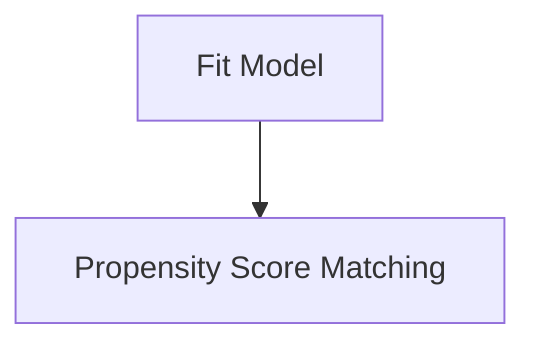

# Modeling_Odds_of_Misfolding  
Here we model the log-odds of observing a change in proteolysis suseptibility (i.e. misfolding) as a function of the amino acid composition and the region of the protein it was observed in (i.e. entangled region or non-entangled region). We use logistic regression and fit the following model using the maximal likelihood optimiztion method.

$$
\text{log(odds)} \approx B_0 + B_1 \cdot X_1 + B_2 \cdot X_2
$$

## General workflow


## Binomial logistic regression


### Usage of [src/data/Regression.py](src/data/Regression.py)
```
usage: Regression.py [-h] -f RESFEAT_FILES -o OUTPATH -g GENE_LIST -t TAG -l LOAD_STYLE -b BUFFER -s SPA -c COV -r REG_FORMULA -v HOLD_VAR

Process user specified arguments

options:
  -h, --help            show this help message and exit
  -f RESFEAT_FILES, --resFeat_files RESFEAT_FILES
                        Path to residue feature files
  -o OUTPATH, --outpath OUTPATH
                        Path to output directory
  -g GENE_LIST, --gene_list GENE_LIST
                        Path to gene list to use
  -t TAG, --tag TAG     Tag for output filenames
  -l LOAD_STYLE, --load_style LOAD_STYLE
                        Load style (True: load by gene, False: load a single file with all genes present)
  -b BUFFER, --buffer BUFFER
                        Buffer system to use
  -s SPA, --spa SPA     SPA threshold
  -c COV, --cov COV     LiPMS cov threshold
  -r REG_FORMULA, --reg_formula REG_FORMULA
                        Regression formula
  -v HOLD_VAR, --hold_var HOLD_VAR
                        Variable to hold constant while calculating odds
```


If you have the [SLUG] then you can use the command files located [here](src/command_lists/Regressions_whole_proteome.cmds) to reproduce the binomial logistic regressions used in this work to fit the experimental data and the AlphaFold structures. Please modify any other pathing as necessary. 

### Results 
| Set Type               | Timepoint | Structure Type | Contains "ent_" | Link to File                                                                                   |
|------------------------|-----------|----------------|-----------------|------------------------------------------------------------------------------------------------|
| all                    | R1min     | EXP            | No              | [all_genes_R1min](Figures/Regressions/whole_proteome/EXP/all_genes_R1min_binomial_regression_results_var-region_LiPMScov50.png)       |
| essential_ent           | R1min     | EXP            | Yes             | [essential_ent_genes_R1min](Figures/Regressions/whole_proteome/EXP/essential_ent_genes_R1min_binomial_regression_results_var-region_LiPMScov50.png) |
| nonessential_ent        | R1min     | EXP            | Yes             | [nonessential_ent_genes_R1min](Figures/Regressions/whole_proteome/EXP/nonessential_ent_genes_R1min_binomial_regression_results_var-region_LiPMScov50.png) |
| ent                    | R1min     | EXP            | Yes             | [ent_genes_R1min](Figures/Regressions/whole_proteome/EXP/ent_genes_R1min_binomial_regression_results_var-region_LiPMScov50.png)         |
| essential              | R1min     | EXP            | No              | [essential_genes_R1min](Figures/Regressions/whole_proteome/EXP/essential_genes_R1min_binomial_regression_results_var-region_LiPMScov50.png) |
| nonessential           | R1min     | EXP            | No              | [nonessential_genes_R1min](Figures/Regressions/whole_proteome/EXP/nonessential_genes_R1min_binomial_regression_results_var-region_LiPMScov50.png) |
| all                    | R5min     | EXP            | No              | [all_genes_R5min](Figures/Regressions/whole_proteome/EXP/all_genes_R5min_binomial_regression_results_var-region_LiPMScov50.png)     |
| essential_ent           | R5min     | EXP            | Yes             | [essential_ent_genes_R5min](Figures/Regressions/whole_proteome/EXP/essential_ent_genes_R5min_binomial_regression_results_var-region_LiPMScov50.png) |
| nonessential_ent        | R5min     | EXP            | Yes             | [nonessential_ent_genes_R5min](Figures/Regressions/whole_proteome/EXP/nonessential_ent_genes_R5min_binomial_regression_results_var-region_LiPMScov50.png) |
| ent                    | R5min     | EXP            | Yes             | [ent_genes_R5min](Figures/Regressions/whole_proteome/EXP/ent_genes_R5min_binomial_regression_results_var-region_LiPMScov50.png)         |
| essential              | R5min     | EXP            | No              | [essential_genes_R5min](Figures/Regressions/whole_proteome/EXP/essential_genes_R5min_binomial_regression_results_var-region_LiPMScov50.png) |
| nonessential           | R5min     | EXP            | No              | [nonessential_genes_R5min](Figures/Regressions/whole_proteome/EXP/nonessential_genes_R5min_binomial_regression_results_var-region_LiPMScov50.png) |
| all                    | R2hr      | EXP            | No              | [all_genes_R2hr](Figures/Regressions/whole_proteome/EXP/all_genes_R2hr_binomial_regression_results_var-region_LiPMScov50.png)       |
| essential_ent           | R2hr      | EXP            | Yes             | [essential_ent_genes_R2hr](Figures/Regressions/whole_proteome/EXP/essential_ent_genes_R2hr_binomial_regression_results_var-region_LiPMScov50.png) |
| nonessential_ent        | R2hr      | EXP            | Yes             | [nonessential_ent_genes_R2hr](Figures/Regressions/whole_proteome/EXP/nonessential_ent_genes_R2hr_binomial_regression_results_var-region_LiPMScov50.png) |
| ent                    | R2hr      | EXP            | Yes             | [ent_genes_R2hr](Figures/Regressions/whole_proteome/EXP/ent_genes_R2hr_binomial_regression_results_var-region_LiPMScov50.png)         |
| essential              | R2hr      | EXP            | No              | [essential_genes_R2hr](Figures/Regressions/whole_proteome/EXP/essential_genes_R2hr_binomial_regression_results_var-region_LiPMScov50.png) |
| nonessential           | R2hr      | EXP            | No              | [nonessential_genes_R2hr](Figures/Regressions/whole_proteome/EXP/nonessential_genes_R2hr_binomial_regression_results_var-region_LiPMScov50.png) |
| all                    | Rall      | EXP            | No              | [all_genes_Rall](Figures/Regressions/whole_proteome/EXP/all_genes_Rall_binomial_regression_results_var-region_LiPMScov50.png)        |
| essential_ent           | Rall      | EXP            | Yes             | [essential_ent_genes_Rall](Figures/Regressions/whole_proteome/EXP/essential_ent_genes_Rall_binomial_regression_results_var-region_LiPMScov50.png) |
| nonessential_ent        | Rall      | EXP            | Yes             | [nonessential_ent_genes_Rall](Figures/Regressions/whole_proteome/EXP/nonessential_ent_genes_Rall_binomial_regression_results_var-region_LiPMScov50.png) |
| ent                    | Rall      | EXP            | Yes             | [ent_genes_Rall](Figures/Regressions/whole_proteome/EXP/ent_genes_Rall_binomial_regression_results_var-region_LiPMScov50.png)         |
| essential              | Rall      | EXP            | No              | [essential_genes_Rall](Figures/Regressions/whole_proteome/EXP/essential_genes_Rall_binomial_regression_results_var-region_LiPMScov50.png) |
| nonessential           | Rall      | EXP            | No              | [nonessential_genes_Rall](Figures/Regressions/whole_proteome/EXP/nonessential_genes_Rall_binomial_regression_results_var-region_LiPMScov50.png) |

