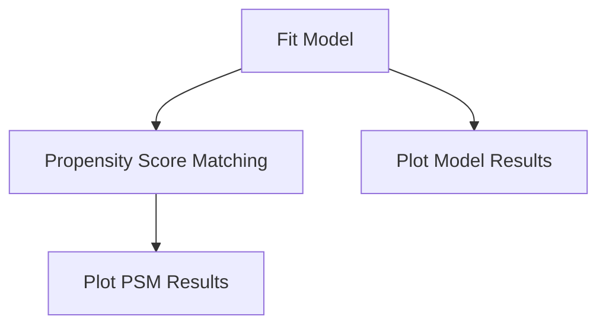
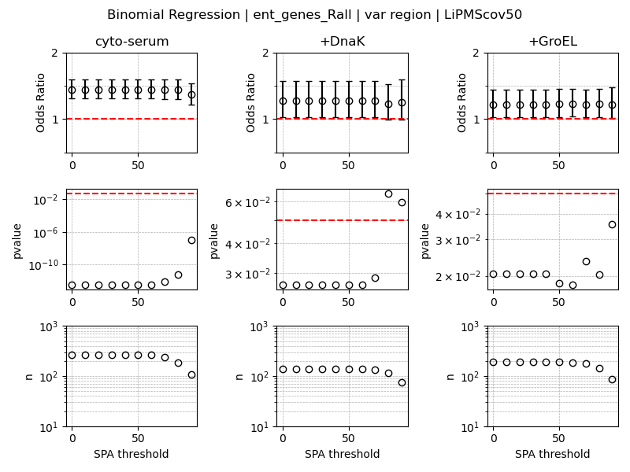
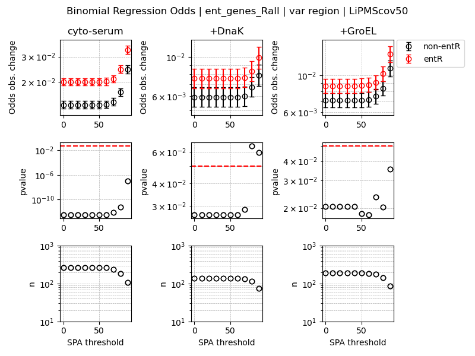
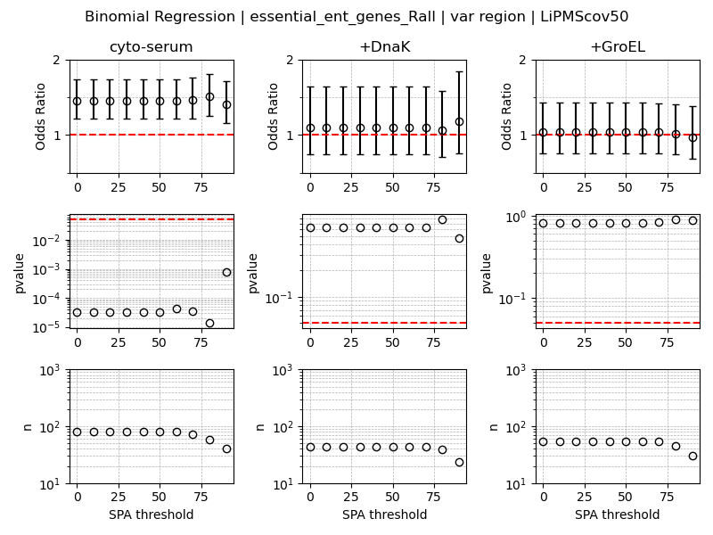
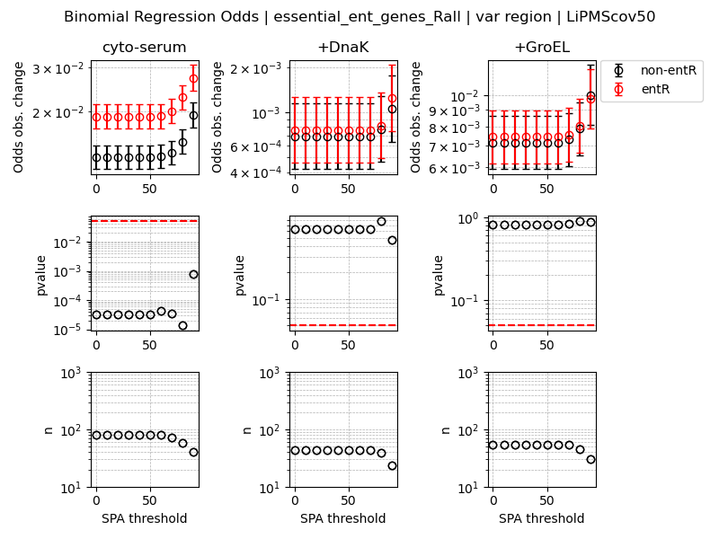
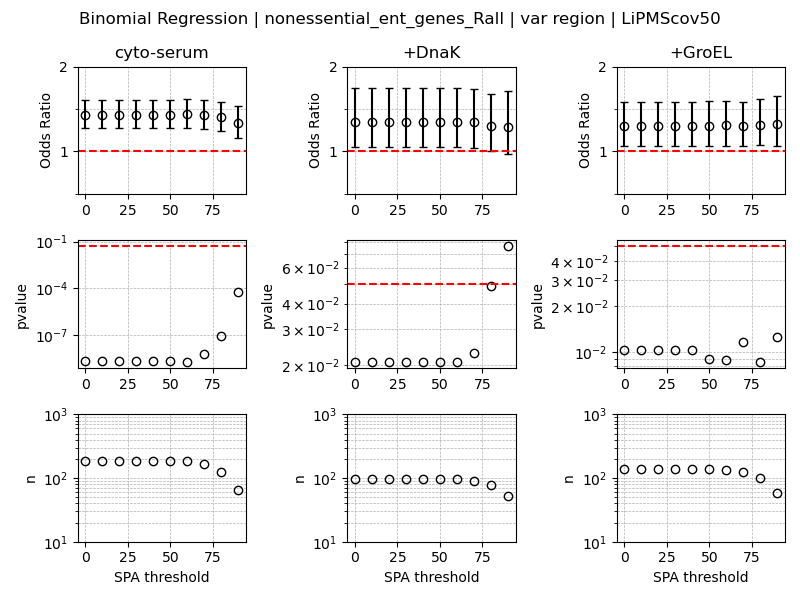
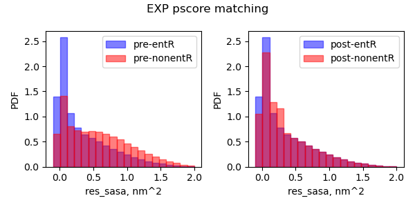
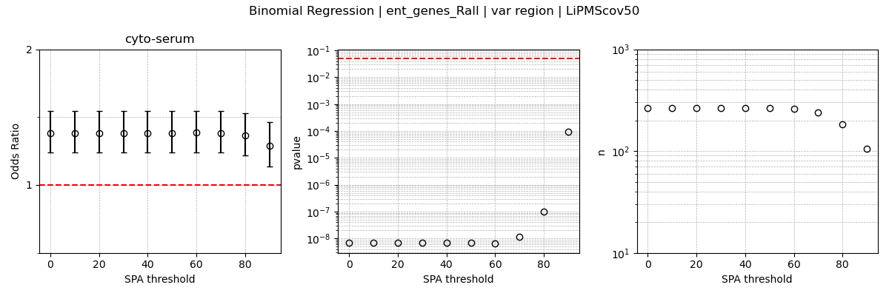
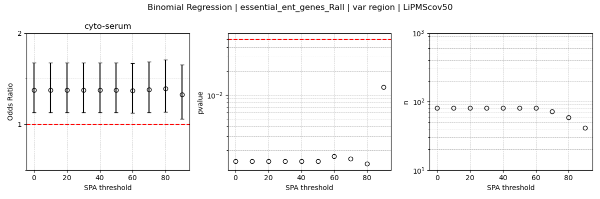
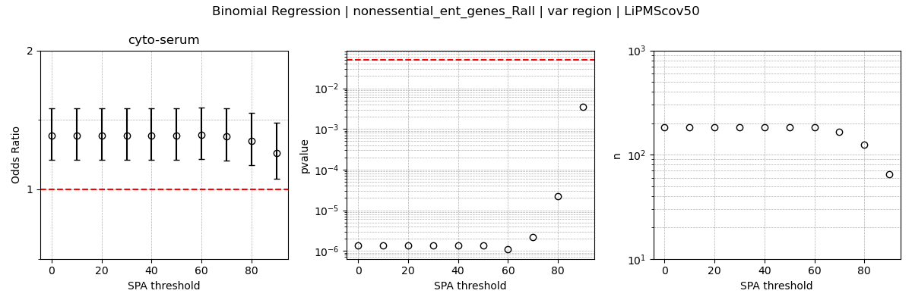

# Modeling_Odds_of_Misfolding  
Here we model the log-odds of observing a change in proteolysis suseptibility (i.e. misfolding) as a function of the amino acid composition and the region of the protein it was observed in (i.e. entangled region or non-entangled region).

## General workflow

## Basic theory  
### How Binomial Logistic Regression Works
1. **Binary Outcome**:
   - The dependent variable is binary, meaning it takes on one of two possible values, usually coded as 0 and 1.

2. **Odds and Logits**:
   - The **odds** of an event occurring are defined as:
     $$
     \text{Odds} = \frac{p}{1 - p}
     $$
     where $ p $ is the probability of the event.
   - The **logit** is the natural logarithm of the odds:
     $$
     \text{Logit}(p) = \log\left(\frac{p}{1 - p}\right)
     $$
   - Logistic regression models the **logit of the probability** rather than the probability itself.

3. **Logistic Regression Equation**:
   - The logistic regression model is:
     $$
     \text{Logit}(p) = \beta_0 + \beta_1 x_1 + \beta_2 x_2 + \ldots + \beta_n x_n
     $$
   - It can be transformed to estimate the probability $ p $ using the **logistic function**:
     $$
     p = \frac{1}{1 + e^{-(\beta_0 + \beta_1 x_1 + \ldots + \beta_n x_n)}}
     $$

### Deriving and Interpreting Odds Ratios from Coefficients
1. **Coefficients in Logistic Regression**:
   - The coefficients $ \beta_0, \beta_1, \ldots, \beta_n $ represent the change in the **log-odds** of the outcome for a one-unit change in the predictor variables.

2. **Calculating Odds Ratios**:
   - The **odds ratio (OR)** is calculated by taking the **exponent of the logistic regression coefficient**:
     $$
     \text{Odds Ratio} = e^{\beta_i}
     $$
   - For each predictor variable $ x_i $, the corresponding odds ratio $ e^{\beta_i} $ tells us how the odds of the outcome change with a one-unit increase in $ x_i $.

3. **Interpreting Odds Ratios**:
   - An **odds ratio > 1** indicates that an increase in the predictor variable is associated with higher odds of the event occurring.
   - An **odds ratio < 1** indicates that an increase in the predictor variable is associated with lower odds of the event occurring.
   - An **odds ratio = 1** suggests no effect of the predictor on the odds of the outcome.

### Advantages of Binomial Logistic Regression
1. **Probabilistic Predictions**:
   - Provides probabilities that can be used for decision-making.
   
2. **Interpretable Coefficients**:
   - Coefficients are interpretable in terms of log-odds, and the odds ratios offer an intuitive understanding of the effect size.

3. **Flexibility**:
   - Works well with both continuous and categorical predictors.

4. **Non-linearity Handling**:
   - While the model assumes linearity in the logit, the resulting probability curve is S-shaped, allowing for more flexibility than linear regression.

5. **Well-Suited for Binary Outcomes**:
   - Designed specifically to handle binary outcomes, making it ideal for classification tasks.

### Limitations of Binomial Logistic Regression
1. **Linearity Assumption in the Logit**:
   - Assumes a linear relationship between the log-odds of the outcome and the predictors, which may not always hold.

2. **Sensitive to Outliers**:
   - Outliers can affect the model’s performance, as they do in other regression models.

3. **No Inherent Handling of Non-linearity**:
   - Without transformations or interaction terms, it may struggle to capture complex relationships.

4. **Binary Outcome Only**:
   - Limited to cases where the response variable is binary, unlike multinomial or ordinal logistic regression, which can handle multiple classes.

5. **No Handling of Multicollinearity**:
   - Highly correlated predictors can cause instability in the estimation of coefficients.

### Usage of [src/data/Regression.py](src/data/Regression.py)
Will fit the following model 
$$
\text{Logit}(p) = \beta_0 + \beta_{region} x_{region} + \sum_{AA} \beta_{AA} x_{AA} 
$$
where $\text{Logit}(p)$ is the log-odds of observing a change in proteolysis suseptibility. $x_{region}$ is a binary classifier of whether the potential PK cut-site was in an entangled region or not. $x_{AA}$ is a binary classifier of whether the potential PK cut-site was of amino acid type $AA$.  

```
usage: Regression.py [-h] -f RESFEAT_FILES -o OUTPATH -g GENE_LIST -t TAG -l LOAD_STYLE -b BUFFER -s SPA -c COV -r REG_FORMULA -v HOLD_VAR

Process user specified arguments

options:
  -h, --help            show this help message and exit
  -f RESFEAT_FILES, --resFeat_files RESFEAT_FILES
                        Path to residue feature files
  -o OUTPATH, --outpath OUTPATH
                        Path to output directory
  -g GENE_LIST, --gene_list GENE_LIST
                        Path to gene list to use
  -t TAG, --tag TAG     Tag for output filenames
  -l LOAD_STYLE, --load_style LOAD_STYLE
                        Load style (True: load by gene, False: load a single file with all genes present)
  -b BUFFER, --buffer BUFFER
                        Buffer system to use
  -s SPA, --spa SPA     SPA threshold
  -c COV, --cov COV     LiPMS cov threshold
  -r REG_FORMULA, --reg_formula REG_FORMULA
                        Regression formula
  -v HOLD_VAR, --hold_var HOLD_VAR
                        Variable to hold constant while calculating odds
```

If you have the [SLUG] then you can use the command files located [here](src/command_lists/Regressions_whole_proteome.cmds) to reproduce the binomial logistic regressions used in this work to fit the experimental data and the AlphaFold structures. Please modify any other pathing as necessary. 

### Usage of [Plot_Regression_results.py](src/data/Plot_Regression_results.py)
```
usage: Plot_Regression_results.py [-h] -f INP_FILES -o OUTPATH -t TAG -r REGRESSION_VAR

Process regression data and generate plots.

options:
  -h, --help            show this help message and exit
  -f INP_FILES, --inp_files INP_FILES
                        Input file pattern for regression data.
  -o OUTPATH, --outpath OUTPATH
                        Path to output directory.
  -t TAG, --tag TAG     Tag for output filenames.
  -r REGRESSION_VAR, --regression_var REGRESSION_VAR
                        regression variable you wish to plot
```

If you have the [SLUG] then you can use the command files located [here](src/command_lists/Plot_Regression_whole_proteome.cmds) to plot the results for both the experimental and Alphafold datasets used in this work. Please modify any other pathing as necessary. 

### Results of modeling log-odds of misfolding
When considering only those proteins with native entanglements we observe a statistically significant greater odds of misfolding in the entangled region of proteins rather than not. Even in the presence of DnaK and GroEL.  
    
    

When we restrict ourselves to the set of essential proteins determined by knockout experiments reported in the [DEG](http://origin.tubic.org/deg/public/index.php) database we observe no statistical association in the presence of chaperones.  
  
  
  
While for the complimentary set of non-essential proteins we still observe the bias towards misfolding involving native entanglements in the presence of chaperones.  
  
  

  
Below is a table of all our results across both the sets of experimentally derived structures and Alphafold structures as well as at each individual time point observed in the LiPMS experiments.  

| Set Type               | Timepoint | Structure Type | Entangled Only | Link to File                                                                                   |
|------------------------|-----------|----------------|-----------------|------------------------------------------------------------------------------------------------|
| all                    | R1min     | EXP            | No-ENT              | [all_genes_R1min](Figures/Regressions/whole_proteome/EXP/all_genes_R1min_binomial_regression_results_var-region_LiPMScov50.png)       |
| essential_ent           | R1min     | EXP            | Yes-ENT             | [essential_ent_genes_R1min](Figures/Regressions/whole_proteome/EXP/essential_ent_genes_R1min_binomial_regression_results_var-region_LiPMScov50.png) |
| nonessential_ent        | R1min     | EXP            | Yes-ENT             | [nonessential_ent_genes_R1min](Figures/Regressions/whole_proteome/EXP/nonessential_ent_genes_R1min_binomial_regression_results_var-region_LiPMScov50.png) |
| ent                    | R1min     | EXP            | Yes-ENT             | [ent_genes_R1min](Figures/Regressions/whole_proteome/EXP/ent_genes_R1min_binomial_regression_results_var-region_LiPMScov50.png)         |
| essential              | R1min     | EXP            | No-ENT              | [essential_genes_R1min](Figures/Regressions/whole_proteome/EXP/essential_genes_R1min_binomial_regression_results_var-region_LiPMScov50.png) |
| nonessential           | R1min     | EXP            | No-ENT              | [nonessential_genes_R1min](Figures/Regressions/whole_proteome/EXP/nonessential_genes_R1min_binomial_regression_results_var-region_LiPMScov50.png) |
| all                    | R5min     | EXP            | No-ENT              | [all_genes_R5min](Figures/Regressions/whole_proteome/EXP/all_genes_R5min_binomial_regression_results_var-region_LiPMScov50.png)     |
| essential_ent           | R5min     | EXP            | Yes-ENT             | [essential_ent_genes_R5min](Figures/Regressions/whole_proteome/EXP/essential_ent_genes_R5min_binomial_regression_results_var-region_LiPMScov50.png) |
| nonessential_ent        | R5min     | EXP            | Yes-ENT             | [nonessential_ent_genes_R5min](Figures/Regressions/whole_proteome/EXP/nonessential_ent_genes_R5min_binomial_regression_results_var-region_LiPMScov50.png) |
| ent                    | R5min     | EXP            | Yes-ENT             | [ent_genes_R5min](Figures/Regressions/whole_proteome/EXP/ent_genes_R5min_binomial_regression_results_var-region_LiPMScov50.png)         |
| essential              | R5min     | EXP            | No-ENT              | [essential_genes_R5min](Figures/Regressions/whole_proteome/EXP/essential_genes_R5min_binomial_regression_results_var-region_LiPMScov50.png) |
| nonessential           | R5min     | EXP            | No-ENT              | [nonessential_genes_R5min](Figures/Regressions/whole_proteome/EXP/nonessential_genes_R5min_binomial_regression_results_var-region_LiPMScov50.png) |
| all                    | R2hr      | EXP            | No-ENT              | [all_genes_R2hr](Figures/Regressions/whole_proteome/EXP/all_genes_R2hr_binomial_regression_results_var-region_LiPMScov50.png)       |
| essential_ent           | R2hr      | EXP            | Yes-ENT             | [essential_ent_genes_R2hr](Figures/Regressions/whole_proteome/EXP/essential_ent_genes_R2hr_binomial_regression_results_var-region_LiPMScov50.png) |
| nonessential_ent        | R2hr      | EXP            | Yes-ENT             | [nonessential_ent_genes_R2hr](Figures/Regressions/whole_proteome/EXP/nonessential_ent_genes_R2hr_binomial_regression_results_var-region_LiPMScov50.png) |
| ent                    | R2hr      | EXP            | Yes-ENT             | [ent_genes_R2hr](Figures/Regressions/whole_proteome/EXP/ent_genes_R2hr_binomial_regression_results_var-region_LiPMScov50.png)         |
| essential              | R2hr      | EXP            | No-ENT              | [essential_genes_R2hr](Figures/Regressions/whole_proteome/EXP/essential_genes_R2hr_binomial_regression_results_var-region_LiPMScov50.png) |
| nonessential           | R2hr      | EXP            | No-ENT              | [nonessential_genes_R2hr](Figures/Regressions/whole_proteome/EXP/nonessential_genes_R2hr_binomial_regression_results_var-region_LiPMScov50.png) |
| all                    | Rall      | EXP            | No-ENT              | [all_genes_Rall](Figures/Regressions/whole_proteome/EXP/all_genes_Rall_binomial_regression_results_var-region_LiPMScov50.png)        |
| essential_ent           | Rall      | EXP            | Yes-ENT             | [essential_ent_genes_Rall](Figures/Regressions/whole_proteome/EXP/essential_ent_genes_Rall_binomial_regression_results_var-region_LiPMScov50.png) |
| nonessential_ent        | Rall      | EXP            | Yes-ENT             | [nonessential_ent_genes_Rall](Figures/Regressions/whole_proteome/EXP/nonessential_ent_genes_Rall_binomial_regression_results_var-region_LiPMScov50.png) |
| ent                    | Rall      | EXP            | Yes-ENT             | [ent_genes_Rall](Figures/Regressions/whole_proteome/EXP/ent_genes_Rall_binomial_regression_results_var-region_LiPMScov50.png)         |
| essential              | Rall      | EXP            | No-ENT              | [essential_genes_Rall](Figures/Regressions/whole_proteome/EXP/essential_genes_Rall_binomial_regression_results_var-region_LiPMScov50.png) |
| nonessential           | Rall      | EXP            | No-ENT              | [nonessential_genes_Rall](Figures/Regressions/whole_proteome/EXP/nonessential_genes_Rall_binomial_regression_results_var-region_LiPMScov50.png) |
| all                    | R1min     | AF            | No-ENT              | [all_genes_R1min](Figures/Regressions/whole_proteome/AF/all_genes_R1min_binomial_regression_results_var-region_LiPMScov50.png)       |
| essential_ent           | R1min     | AF            | Yes-ENT             | [essential_ent_genes_R1min](Figures/Regressions/whole_proteome/AF/essential_ent_genes_R1min_binomial_regression_results_var-region_LiPMScov50.png) |
| nonessential_ent        | R1min     | AF            | Yes-ENT             | [nonessential_ent_genes_R1min](Figures/Regressions/whole_proteome/AF/nonessential_ent_genes_R1min_binomial_regression_results_var-region_LiPMScov50.png) |
| ent                    | R1min     | AF            | Yes-ENT             | [ent_genes_R1min](Figures/Regressions/whole_proteome/AF/ent_genes_R1min_binomial_regression_results_var-region_LiPMScov50.png)         |
| essential              | R1min     | AF            | No-ENT              | [essential_genes_R1min](Figures/Regressions/whole_proteome/AF/essential_genes_R1min_binomial_regression_results_var-region_LiPMScov50.png) |
| nonessential           | R1min     | AF            | No-ENT              | [nonessential_genes_R1min](Figures/Regressions/whole_proteome/AF/nonessential_genes_R1min_binomial_regression_results_var-region_LiPMScov50.png) |
| all                    | R5min     | AF            | No-ENT              | [all_genes_R5min](Figures/Regressions/whole_proteome/AF/all_genes_R5min_binomial_regression_results_var-region_LiPMScov50.png)     |
| essential_ent           | R5min     | AF            | Yes-ENT             | [essential_ent_genes_R5min](Figures/Regressions/whole_proteome/AF/essential_ent_genes_R5min_binomial_regression_results_var-region_LiPMScov50.png) |
| nonessential_ent        | R5min     | AF            | Yes-ENT             | [nonessential_ent_genes_R5min](Figures/Regressions/whole_proteome/AF/nonessential_ent_genes_R5min_binomial_regression_results_var-region_LiPMScov50.png) |
| ent                    | R5min     | AF            | Yes-ENT             | [ent_genes_R5min](Figures/Regressions/whole_proteome/AF/ent_genes_R5min_binomial_regression_results_var-region_LiPMScov50.png)         |
| essential              | R5min     | AF            | No-ENT              | [essential_genes_R5min](Figures/Regressions/whole_proteome/AF/essential_genes_R5min_binomial_regression_results_var-region_LiPMScov50.png) |
| nonessential           | R5min     | AF            | No-ENT              | [nonessential_genes_R5min](Figures/Regressions/whole_proteome/AF/nonessential_genes_R5min_binomial_regression_results_var-region_LiPMScov50.png) |
| all                    | R2hr      | AF            | No-ENT              | [all_genes_R2hr](Figures/Regressions/whole_proteome/AF/all_genes_R2hr_binomial_regression_results_var-region_LiPMScov50.png)       |
| essential_ent           | R2hr      | AF            | Yes-ENT             | [essential_ent_genes_R2hr](Figures/Regressions/whole_proteome/AF/essential_ent_genes_R2hr_binomial_regression_results_var-region_LiPMScov50.png) |
| nonessential_ent        | R2hr      | AF            | Yes-ENT             | [nonessential_ent_genes_R2hr](Figures/Regressions/whole_proteome/AF/nonessential_ent_genes_R2hr_binomial_regression_results_var-region_LiPMScov50.png) |
| ent                    | R2hr      | AF            | Yes-ENT             | [ent_genes_R2hr](Figures/Regressions/whole_proteome/AF/ent_genes_R2hr_binomial_regression_results_var-region_LiPMScov50.png)         |
| essential              | R2hr      | AF            | No-ENT              | [essential_genes_R2hr](Figures/Regressions/whole_proteome/AF/essential_genes_R2hr_binomial_regression_results_var-region_LiPMScov50.png) |
| nonessential           | R2hr      | AF            | No-ENT              | [nonessential_genes_R2hr](Figures/Regressions/whole_proteome/AF/nonessential_genes_R2hr_binomial_regression_results_var-region_LiPMScov50.png) |
| all                    | Rall      | AF            | No-ENT              | [all_genes_Rall](Figures/Regressions/whole_proteome/AF/all_genes_Rall_binomial_regression_results_var-region_LiPMScov50.png)        |
| essential_ent           | Rall      | AF            | Yes-ENT             | [essential_ent_genes_Rall](Figures/Regressions/whole_proteome/AF/essential_ent_genes_Rall_binomial_regression_results_var-region_LiPMScov50.png) |
| nonessential_ent        | Rall      | AF            | Yes-ENT             | [nonessential_ent_genes_Rall](Figures/Regressions/whole_proteome/AF/nonessential_ent_genes_Rall_binomial_regression_results_var-region_LiPMScov50.png) |
| ent                    | Rall      | AF            | Yes-ENT             | [ent_genes_Rall](Figures/Regressions/whole_proteome/AF/ent_genes_Rall_binomial_regression_results_var-region_LiPMScov50.png)         |
| essential              | Rall      | AF            | No-ENT              | [essential_genes_Rall](Figures/Regressions/whole_proteome/AF/essential_genes_Rall_binomial_regression_results_var-region_LiPMScov50.png) |
| nonessential           | Rall      | AF            | No-ENT              | [nonessential_genes_Rall](Figures/Regressions/whole_proteome/AF/nonessential_genes_Rall_binomial_regression_results_var-region_LiPMScov50.png) |


## Propensity score matching to control for residue burial
We control for the extent of burial between the entangled and non-entangled regions of proteins in our dataset using propensity score matching [CITE A PAPER]. 

### Usage of [PSM.py](src/data/PSM.py)
```
usage: PSM.py [-h] -f INPFILES -l LOGFILE -o OUTPATH -m MATCH_VAR -n NMATCH

Process user specified arguments

options:
  -h, --help            show this help message and exit
  -f INPFILES, --inpfiles INPFILES
                        Path to residue feature files
  -l LOGFILE, --logfile LOGFILE
                        Path to log file
  -o OUTPATH, --outpath OUTPATH
                        Path to output directory
  -m MATCH_VAR, --match_var MATCH_VAR
                        Variable to match
  -n NMATCH, --nmatch NMATCH
                        Number of matches to attempt
```

If you have the [SLUG] then you can use the command files located [here](src/command_lists/PSM.cmds) to reproduce the propensity score matching used in this work to fit the experimental data and the AlphaFold structures. Please modify any other pathing as necessary. 

### Usage of [Plot_Regression_results.py](src/data/Plot_Regression_results.py)
```
usage: Plot_PSM_results.py [-h] -p PRE_INPFILES -f POST_INPFILES -o OUTPATH -t TAG

Process user specified arguments

options:
  -h, --help            show this help message and exit
  -p PRE_INPFILES, --pre_inpfiles PRE_INPFILES
                        Path to pre-matched residue feature files
  -f POST_INPFILES, --post_inpfiles POST_INPFILES
                        Path to propensity score matched residue feature files
  -o OUTPATH, --outpath OUTPATH
                        Path to output directory
  -t TAG, --tag TAG     Tag for figure title
```

If you have the [SLUG] then you can use the command files located [here](src/command_lists/Plot_PSM.cmds) to plot the results for both the experimental and Alphafold datasets used in this work. Please modify any other pathing as necessary. 
  
### Usage of [Plot_Regression_PSM_results.py](src/data/Plot_Regression_PSM_results.py)
Use to plot the regression results from the propensity score matched data. 
```
usage: Plot_Regression_PSM_results.py [-h] -f INP_FILES -o OUTPATH -t TAG -r REGRESSION_VAR

Process regression data and generate plots.

options:
  -h, --help            show this help message and exit
  -f INP_FILES, --inp_files INP_FILES
                        Input file pattern for regression data.
  -o OUTPATH, --outpath OUTPATH
                        Path to output directory.
  -t TAG, --tag TAG     Tag for output filenames.
  -r REGRESSION_VAR, --regression_var REGRESSION_VAR
                        regression variable you wish to plot
```

If you have the [SLUG] then you can use the command files located [here](src/command_lists/Plot_Regression_PSM.cmds) to plot the regression results for both the experimental structure propensity score matched dataset used in this work. Please modify any other pathing as necessary.  
  
### Results of PSM
The distribution of SASA of residues in the entangled and non-entangled regions of proteins across the set of experimental structures before (left) and after PSM (right).  

  

Controlling for the burial of entangled residues also does not affect the statisitcaly signifincant increase in oddds of misfolding involving native entanglements rather than not.  
  
  
   
  
| Set Type               | Timepoint | Structure Type | Entangled Only | Link to File                                                                                   |
|------------------------|-----------|----------------|-----------------|------------------------------------------------------------------------------------------------|
| all                    | R1min     | EXP            | No-ENT              | [all_genes_R1min](Figures/Regressions/PSM/EXP/all_genes_R1min_binomial_regression_results_var-region_LiPMScov50.png)       |
| essential_ent           | R1min     | EXP            | Yes-ENT             | [essential_ent_genes_R1min](Figures/Regressions/PSM/EXP/essential_ent_genes_R1min_binomial_regression_results_var-region_LiPMScov50.png) |
| nonessential_ent        | R1min     | EXP            | Yes-ENT             | [nonessential_ent_genes_R1min](Figures/Regressions/PSM/EXP/nonessential_ent_genes_R1min_binomial_regression_results_var-region_LiPMScov50.png) |
| ent                    | R1min     | EXP            | Yes-ENT             | [ent_genes_R1min](Figures/Regressions/PSM/EXP/ent_genes_R1min_binomial_regression_results_var-region_LiPMScov50.png)         |
| essential              | R1min     | EXP            | No-ENT              | [essential_genes_R1min](Figures/Regressions/PSM/EXP/essential_genes_R1min_binomial_regression_results_var-region_LiPMScov50.png) |
| nonessential           | R1min     | EXP            | No-ENT              | [nonessential_genes_R1min](Figures/Regressions/PSM/EXP/nonessential_genes_R1min_binomial_regression_results_var-region_LiPMScov50.png) |
| all                    | R5min     | EXP            | No-ENT              | [all_genes_R5min](Figures/Regressions/PSM/EXP/all_genes_R5min_binomial_regression_results_var-region_LiPMScov50.png)     |
| essential_ent           | R5min     | EXP            | Yes-ENT             | [essential_ent_genes_R5min](Figures/Regressions/PSM/EXP/essential_ent_genes_R5min_binomial_regression_results_var-region_LiPMScov50.png) |
| nonessential_ent        | R5min     | EXP            | Yes-ENT             | [nonessential_ent_genes_R5min](Figures/Regressions/PSM/EXP/nonessential_ent_genes_R5min_binomial_regression_results_var-region_LiPMScov50.png) |
| ent                    | R5min     | EXP            | Yes-ENT             | [ent_genes_R5min](Figures/Regressions/PSM/EXP/ent_genes_R5min_binomial_regression_results_var-region_LiPMScov50.png)         |
| essential              | R5min     | EXP            | No-ENT              | [essential_genes_R5min](Figures/Regressions/PSM/EXP/essential_genes_R5min_binomial_regression_results_var-region_LiPMScov50.png) |
| nonessential           | R5min     | EXP            | No-ENT              | [nonessential_genes_R5min](Figures/Regressions/PSM/EXP/nonessential_genes_R5min_binomial_regression_results_var-region_LiPMScov50.png) |
| all                    | R2hr      | EXP            | No-ENT              | [all_genes_R2hr](Figures/Regressions/PSM/EXP/all_genes_R2hr_binomial_regression_results_var-region_LiPMScov50.png)       |
| essential_ent           | R2hr      | EXP            | Yes-ENT             | [essential_ent_genes_R2hr](Figures/Regressions/PSM/EXP/essential_ent_genes_R2hr_binomial_regression_results_var-region_LiPMScov50.png) |
| nonessential_ent        | R2hr      | EXP            | Yes-ENT             | [nonessential_ent_genes_R2hr](Figures/Regressions/PSM/EXP/nonessential_ent_genes_R2hr_binomial_regression_results_var-region_LiPMScov50.png) |
| ent                    | R2hr      | EXP            | Yes-ENT             | [ent_genes_R2hr](Figures/Regressions/PSM/EXP/ent_genes_R2hr_binomial_regression_results_var-region_LiPMScov50.png)         |
| essential              | R2hr      | EXP            | No-ENT              | [essential_genes_R2hr](Figures/Regressions/PSM/EXP/essential_genes_R2hr_binomial_regression_results_var-region_LiPMScov50.png) |
| nonessential           | R2hr      | EXP            | No-ENT              | [nonessential_genes_R2hr](Figures/Regressions/PSM/EXP/nonessential_genes_R2hr_binomial_regression_results_var-region_LiPMScov50.png) |
| all                    | Rall      | EXP            | No-ENT              | [all_genes_Rall](Figures/Regressions/PSM/EXP/all_genes_Rall_binomial_regression_results_var-region_LiPMScov50.png)        |
| essential_ent           | Rall      | EXP            | Yes-ENT             | [essential_ent_genes_Rall](Figures/Regressions/PSM/EXP/essential_ent_genes_Rall_binomial_regression_results_var-region_LiPMScov50.png) |
| nonessential_ent        | Rall      | EXP            | Yes-ENT             | [nonessential_ent_genes_Rall](Figures/Regressions/PSM/EXP/nonessential_ent_genes_Rall_binomial_regression_results_var-region_LiPMScov50.png) |
| ent                    | Rall      | EXP            | Yes-ENT             | [ent_genes_Rall](Figures/Regressions/PSM/EXP/ent_genes_Rall_binomial_regression_results_var-region_LiPMScov50.png)         |
| essential              | Rall      | EXP            | No-ENT              | [essential_genes_Rall](Figures/Regressions/PSM/EXP/essential_genes_Rall_binomial_regression_results_var-region_LiPMScov50.png) |
| nonessential           | Rall      | EXP            | No-ENT              | [nonessential_genes_Rall](Figures/Regressions/PSM/EXP/nonessential_genes_Rall_binomial_regression_results_var-region_LiPMScov50.png) |
