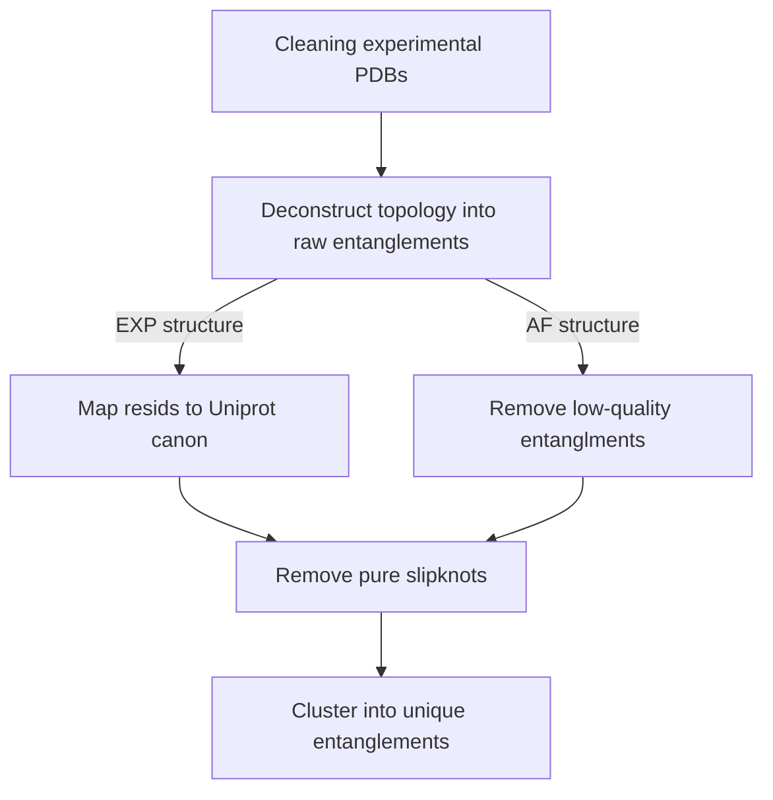

# Generating native entanglements of protein structures
This analysis deconstructs a protein structures topology into a series of loops closed by non-covalent lassos and threading segments. 
We then cluster the deconstructed topology to assign unique entanglements for each protein structure in either our set of high quality PDBs or AF(v4) structures. 
You can read more about this method in these papers [PAPER link PLACEHOLDER]. 

## General workflow 

