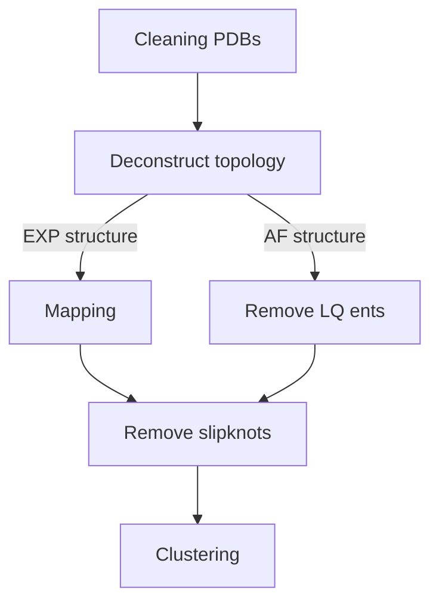

# Generating native entanglements of protein structures
This analysis deconstructs a protein structures topology into a series of loops closed by non-covalent lassos and threading segments. 
We then cluster the deconstructed topology to assign unique entanglements for each protein structure in either our set of high quality PDBs or AF(v4) structures. 
You can read more about this method in these papers [PAPER link PLACEHOLDER]. 

## General workflow 


### Cleaning PDBs  
We do not provide code explicitly to clean a PDB file but the following should be done to ensure the pipeline runs smoothly.
1. Separate each chain into a separate PDB file.  
2. Ensure there are no duplicate residues present.  
3. Ensure there are no resids with letters after. (100A or 100B ... ect)
4. Remove any waters and only keep the ATOM records.

If you have the [PLACE HOLDER FOR TAR BALL] you can see examples in /path/to/slug/Native_Entanglements_in_PDBs/Representative_experimental_structures/Ecoli/PDBs/  

AlphaFold structures do not require cleaning and are good to use as is.  
  
  
### Deconstructing structure topology into raw entanglements  
Here we take a protein structure file (PDB) and deconstruct it into all possible loops closed by native contacts that have threading events (entanglements) identified by the Gauss Linking Integration method.  
For the theory of how this works please see [PAPER link PLACEHOLDER].  
The script is standalone and can be applied to any PDB [gaussian_entanglement.py](src/data/gaussian_entanglement.py). 

#### Usage 
```
usage: gaussian_entanglement.py [-h] --PDB PDB [--GLN_threshold GLN_THRESHOLD] [--Calpha CALPHA] [--topoly_density TOPOLY_DENSITY]

Process user specified arguments

options:
  -h, --help            show this help message and exit
  --PDB PDB             Path to PDB file you want to generate raw entanglments for
  --GLN_threshold GLN_THRESHOLD
                        Threshold applied to the absoluate value of the Gauss linking value to determine if an entanglement is present
  --Calpha CALPHA       True: use CA 8A cutoff 
			False: use 4.5A heavy atom cutoff for native contacts [Defualt]
  --topoly_density TOPOLY_DENSITY
                        Density of the triangulation of minimal loop surface for determining pericing. Default=0 to speed up calculations but might cause unrealistic crossings in AF structures with large disorderd loops. Increase to 1 if that is the case
```

If you have the [SLUG] then you can use the command files located [here](src/command_lists/) to reproduce the initial set of raw entanglements used in this work. Please replace the "path-to-slug" with your own relative path and modify any other pathing as necessary. 

#### Standalone examples  
There is a standalone example for experimentally derived structures located [here](examples/EXP/) and for AlphaFold structures [here](examples/AF/).  

