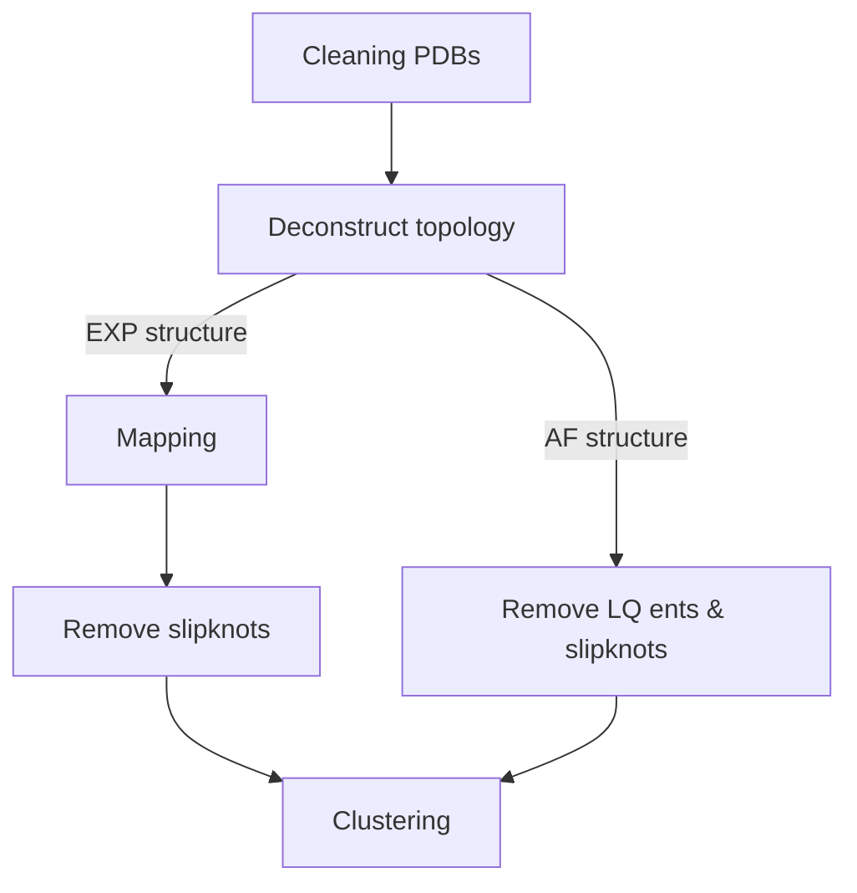

# Generating native entanglements of protein structures
This analysis deconstructs a protein structures topology into a series of loops closed by non-covalent lassos and threading segments. 
We then cluster the deconstructed topology to assign unique entanglements for each protein structure in either our set of high quality PDBs or AF(v4) structures. 
You can read more about this method in these papers [PAPER link PLACEHOLDER]. 

## General workflow


## Cleaning PDBs
We do not provide code explicitly to clean a PDB file but the following should be done to ensure the pipeline runs smoothly.
1. Separate each chain into a separate PDB file.  
2. Ensure there are no duplicate residues present.  
3. Ensure there are no resids with letters after. (100A or 100B ... ect)
4. Remove any waters and only keep the ATOM records.

If you have the [PLACE HOLDER FOR TAR BALL] you can see examples in /path/to/slug/Native_Entanglements_in_PDBs/Representative_experimental_structures/Ecoli/PDBs/  

AlphaFold structures do not require cleaning and are good to use as is.  
  
  
## Deconstructing structure topology into raw entanglements
Here we take a protein structure file (PDB) and deconstruct it into all possible loops closed by native contacts that have threading events (entanglements) identified by the Gauss Linking Integration method.  
For the theory of how this works please see [PAPER link PLACEHOLDER].  
The script is standalone and can be applied to any PDB [gaussian_entanglement.py](src/data/gaussian_entanglement.py). 

### Usage of [gaussian_entanglement.py](src/data/gaussian_entanglement.py)
```
usage: gaussian_entanglement.py [-h] --PDB PDB [--GLN_threshold GLN_THRESHOLD] [--Calpha CALPHA] [--topoly_density TOPOLY_DENSITY]

Process user specified arguments

options:
  -h, --help            show this help message and exit
  --PDB PDB             Path to PDB file you want to generate raw entanglments for
  --GLN_threshold GLN_THRESHOLD
                        Threshold applied to the absoluate value of the Gauss linking value to determine if an entanglement is present
  --Calpha CALPHA       True: use CA 8A cutoff 
			False: use 4.5A heavy atom cutoff for native contacts [Defualt]
  --topoly_density TOPOLY_DENSITY
                        Density of the triangulation of minimal loop surface for determining pericing. Default=0 to speed up calculations but might cause unrealistic crossings in AF structures with large disorderd loops. Increase to 1 if that is the case
```

If you have the [SLUG] then you can use the command files located [here](src/command_lists/Ecoli_EXP_gaussian_entanglement.cmds) to reproduce the initial set of raw entanglements used in this work for the experimental structures and [here](src/command_lists/Ecoli_AF_gaussian_entanglement.cmds) for the AlphaFold structures. Please replace the "path-to-slug" with your own relative path and modify any other pathing as necessary. 

### Standalone examples
There is a standalone example for experimentally derived structures located [here](examples/EXP/) and for AlphaFold structures [here](examples/AF/).  

  
## Mapping of experimental PDB resid to Uniprot canon
In a previous paper [LINK TO VIRAJ PAPER] we took the sequence of each high quality PDB structure and mapped the resid to the canonical uniprot sequence using BLAST. 
For each PDB you have there needs to be a corresponding mapping file with the same naming structure.  
```
Representative_experimental_structures/Ecoli/PDBs/P0AD61-4YNG_C.pdb
Representative_experimental_structures/Ecoli/PDBs/P0AD61-4YNG_C_resid_mapping.txt
```
Where the mapping file contains three columns  
1. status of the mapping: (Mapped) (Missense) (Insertion) (Deletion)  
2. the PDB resid  
3. the corresponding Uniprot sequence position 

if an Insertion or Deletion was detected add the string "Left_Empty" into column 3  

Example of the file structure   
```
(Mapped) 1 1
(Mapped) 2 2
(Missense) 3 3
(Mapped) 4 4
(Mapped) 5 5
(Insertion) 6 Left_Empty
(Mapped) 7 7
(Mapped) 8 8
(Deletion) 9 Left_Empty
(Mapped) 10 10
```

Example of the file are located [here](examples/EXP/PDBs/)

The script used to map the results from [gaussian_entanglement.py](src/data/gaussian_entanglement.py) is [get_mapped_ent.py](src/data/get_mapped_ent.py).  

### Usage of [get_mapped_ent.py](src/data/get_mapped_ent.py) 
```
usage: get_mapped_ent.py [-h] -e ENT_FILES -o OUTPATH -m MAPPING

Process user specified arguments

options:
  -h, --help            show this help message and exit
  -e ENT_FILES, --ent_files ENT_FILES
                        path to entanglement files directory
  -o OUTPATH, --outpath OUTPATH
                        path to output directory. will be made if doesnt exist
  -m MAPPING, --mapping MAPPING
                        mapping files directory
```

If you have the [SLUG] then you can use the command files located [here](src/command_lists/Ecoli_EXP_get_mapped_ent.cmds) to reproduce the mapping of the initial set of raw entanglements derived from experimental structures used in this work. Please replace the "path-to-slug" with your own relative path and modify any other pathing as necessary. 

### Standalone examples
There is a standalone example for experimentally derived structures located [here](examples/EXP/).  

## Remove slipknots from experimental PDB entanglements
While we have a threshold on the |Gauss linking value| >= 0.6 to be considered an entanglement there can rarely be slipknots that violate this threshold. Therefore we explicitly remove any entanglement that meets either of the following criteria:
1. the sum of the signs of crossings identified by the [Topoly](https://topoly.cent.uw.edu.pl/documentation.html) package is equal to 0.  
2. there are identical crossings with same sign (an error in topoly assignment we take to indicate uncertainty in the crossing of the loop plane).  

The script used to remove slipknots and duplicate crossings entanglements from the results of [get_mapped_ent.py](src/data/get_mapped_ent.py) is [remove_EXP_slipknots.py](src/data/remove_EXP_slipknots.py).  

### Usage of [remove_EXP_slipknots.py ](src/data/remove_EXP_slipknots.py ) 
```
usage: remove_EXP_slipknots.py [-h] -e ENT_FILES -o OUTPATH

Process user specified arguments

options:
  -h, --help            show this help message and exit
  -e ENT_FILES, --ent_files ENT_FILES
                        path to entanglement files (mapped or unmapped) directory
  -o OUTPATH, --outpath OUTPATH
                        path to output directory. will be made if doesnt exist
```

If you have the [SLUG] then you can use the command files located [here](src/command_lists/Ecoli_EXP_remove_slipknots.cmds) to reproduce the removal of slipknots from the mapped or unmapped set of raw entanglements derived from experimental structures used in this work. Please replace the "path-to-slug" with your own relative path and modify any other pathing as necessary. 

### Standalone examples
There is a standalone example for experimentally derived structures located [here](examples/EXP/). 

## Remove low-quality entanglements and slipknots from AlphaFold structure entanglements
Similar to the experimental structures we remove entanglements that are slipknots and or contain uncertain crossings with both chiralities. Furthermore, for Alphafold structures we also remove entanglements with low-quality predictions as judged by the [pLDDT](https://www.ebi.ac.uk/training/online/courses/alphafold/inputs-and-outputs/evaluating-alphafolds-predicted-structures-using-confidence-scores/plddt-understanding-local-confidence/). Therefore the following criteria must be met to keep an AlphaFold structure and its entanglements. 
1. The structure must have an overall \<pLDDT> greater than or equal to 70. If not the whole structure is discarded.  
2. The loop closing native contacts of a entanglement (i, j) must have a pLDDT >= 70.  
3. The crossings must meet the following high quality order conditions: 
    1. For a given termini that has an entanglement present start at the loop base and in order examine each crossing. 
    2. If the first crossing has a pLDDT >= 70 it is kept and then you move onto the next. 
    3. The first instance of a crossing where the pLDDT < 70 you discard this crossing and any other crossings after it. (if the first crossing after the loop base is low-quality we disregard the whole entanglement with that temrini)
4. After removal of low-quality crossings if the sum of the chirality signs does not equal 0 keep the entanglement. 
5. if there are not identical crossings with same sign. 

This processes ensures we keep only those structures with an overall high quality of prediction and removes any individual entanglements with low-quality predictions.  

The script used to map the results from [gaussian_entanglement.py](src/data/gaussian_entanglement.py) is [get_HQ_AF_structures.py](src/data/get_HQ_AF_structures.py).  

### Usage of [get_HQ_AF_structures.py](src/data/get_HQ_AF_structures.py) 
```
usage: get_HQ_AF_structures.py [-h] -e ENT_FILES -o OUTPATH -p AFPDBS

Process user specified arguments

options:
  -h, --help            show this help message and exit
  -e ENT_FILES, --ent_files ENT_FILES
                        path to entanglement files directory
  -o OUTPATH, --outpath OUTPATH
                        path to output directory. will be made if doesnt exist
  -p AFPDBS, --AFpdbs AFPDBS
                        path to AF pdbs files
```

If you have the [SLUG] then you can use the command files located [here](src/command_lists/Ecoli_get_HQ_AF_structures.cmds) to reproduce the the selection of high-quality AF structures and entanglements used in this work. Please replace the "path-to-slug" with your own relative path and modify any other pathing as necessary. 

A file containing the \<pLDDT> for each AlphaFold structure is located [here](data/avg_pLDDT_AF_structs.csv)

### Standalone examples
There is a standalone example for experimentally derived structures located [here](examples/AF/).  