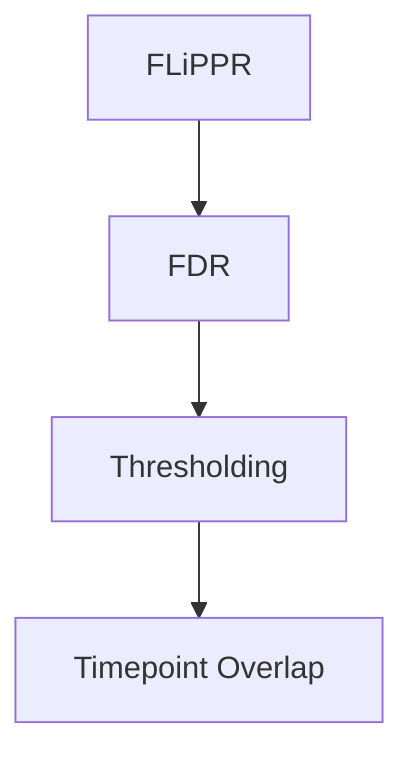
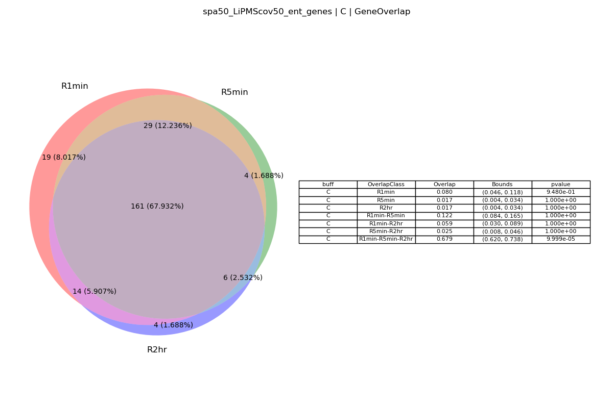
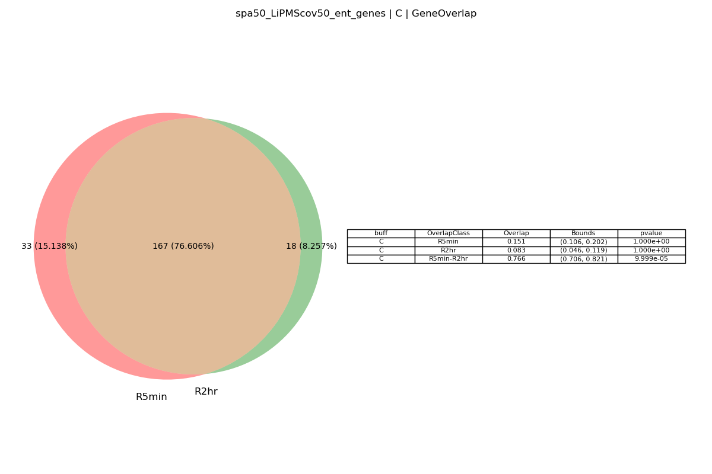
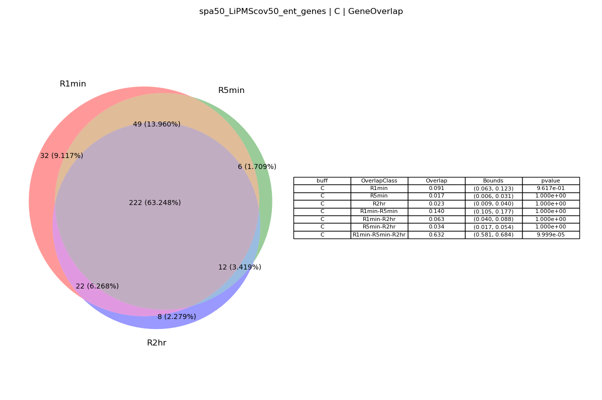
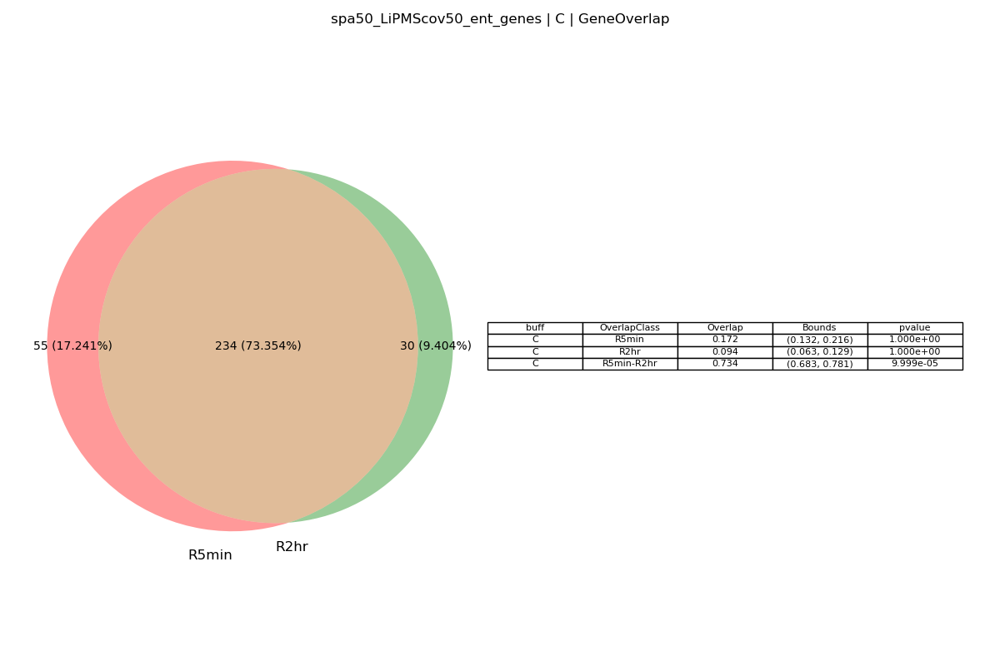
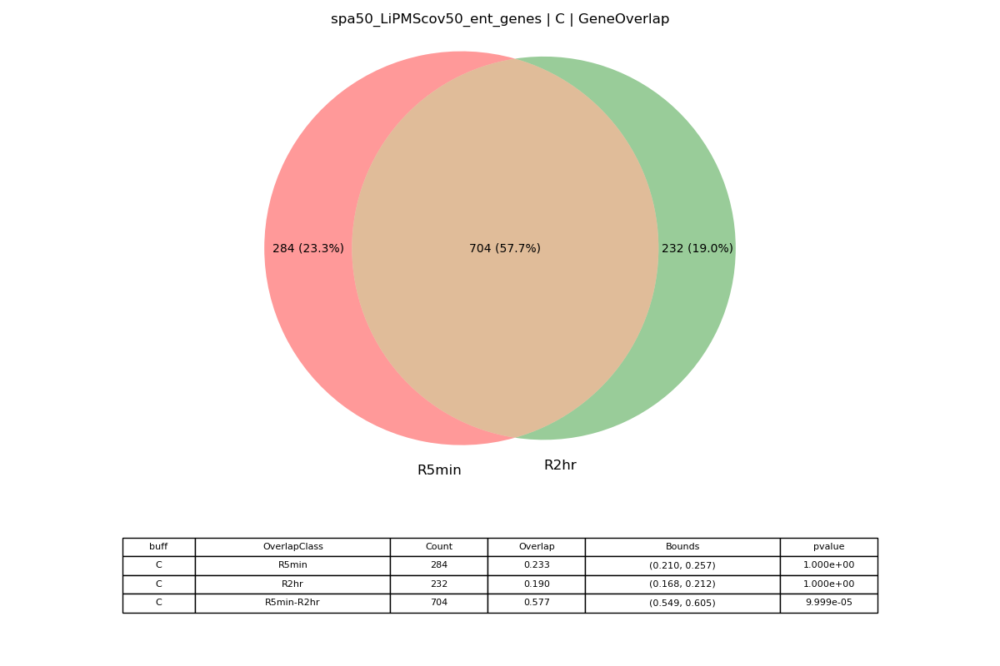
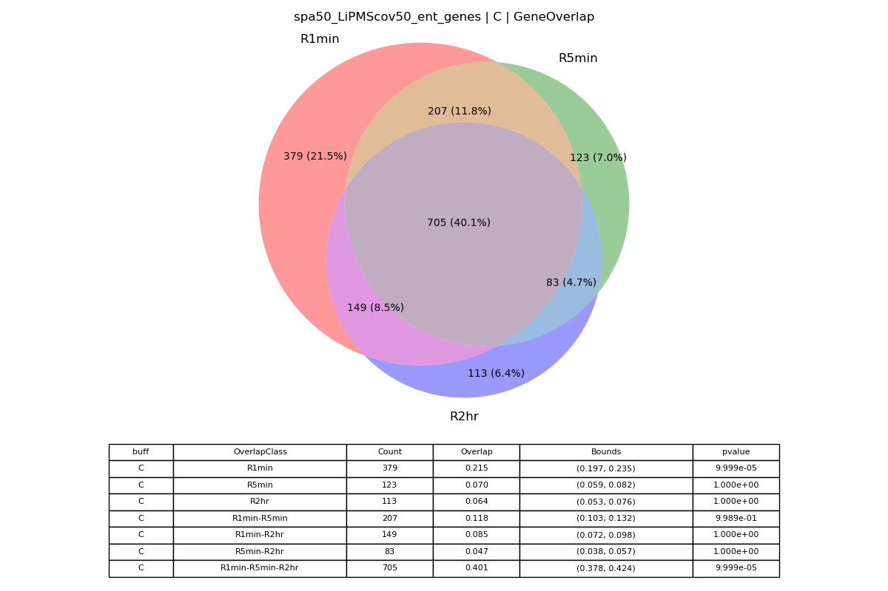

# Processing_LiP-MS_data  

## General workflow


## FLiPPR
We analyze the raw proteome discover data using the [FLiPPR](https://pubs.acs.org/doi/full/10.1021/acs.jproteome.3c00887) protocol. 

### Usage of [FLiPPR.py](src/data/FLiPPR.py)
```
usage: FLiPPR.py [-h] -i INPFILE -o OUTPATH

Process user specified arguments

options:
  -h, --help            show this help message and exit
  -i INPFILE, --inpfile INPFILE
                        Path to raw LiPMS file to process
  -o OUTPATH, --outpath OUTPATH
                        Path to output directory
```

If you have the [SLUG] then you can use the command files located [here](src/command_lists/FliPPR.cmds) to reproduce the FLiPPR analysis done in this work. Please modify any other pathing as necessary. 

## False discovery rate correction
We perform the benjamini hochberg FDR across the whole proteome wide set of half-tryptic peptides instead of the individual proteins.   

### Usage of [FDR_correction_of_LiPMS_data.py](src/data/FDR_correction_of_LiPMS_data.py)
```
usage: FDR_correction_of_LiPMS_data.py [-h] -f LIPMS_FILES -t THRESHOLD -o OUTPATH -a ALPHA

Process user specified arguments for LiPMS files correction.

options:
  -h, --help            show this help message and exit
  -f LIPMS_FILES, --lipms_files LIPMS_FILES
                        path to LiPMS files to correct
  -t THRESHOLD, --threshold THRESHOLD
                        abundance change threshold
  -o OUTPATH, --outpath OUTPATH
                        outpath
  -a ALPHA, --alpha ALPHA
                        family wise error rate: alpha
```

If you have the [SLUG] then you can use the command files located [here](src/command_lists/FDR.cmds) to reproduce the FDR corrected FLiPPR analysis done in this work. Please modify any other pathing as necessary. 


## Thresholding observed proteins by SPA and LiPMS-Coverage
For robustness of results we scan all analysis done in this work along the sum of the peptide abundance SPA percentiles. We also only consider those where atleast 50% of the uniprot canonical sequence was identified in the experiment.   

### Usage of [thresholding.py](src/data/thresholding.py)
```
usage: thresholding.py [-h] -i INPFILES -o OUTPATH -t TAG

Process user specified arguments

options:
  -h, --help            show this help message and exit
  -i INPFILES, --inpfiles INPFILES
                        Path to raw LiPMS file to process
  -o OUTPATH, --outpath OUTPATH
                        Path to output directory
  -t TAG, --tag TAG     Thresholding tag: spa or cov
```

If you have the [SLUG] then you can use the command files located [here](src/command_lists/thresholding.cmds) to reproduce the thresholding of genes along the SPA and or LiPMS-COV analysis done in this work. Please modify any other pathing as necessary. 

## Overlap of misfolded genes and PK sites across 1min, 5min, and 2hr of refolding in LiP-MS experiments
We pool the observed misfolding events across all refolding times in this work for two reasons: 
1. we only care about whether a misfolding event was observed and not necessiarly about its persistence on long time scales.
2. due to the spare nature of the signals resulting from the LiP-MS experiment we pool the data to increase statistical power. 

We therefore need to show that there is significant overlap between the timepoints in both genes observed to misfold and those misfolding sites.  

### Usage of [Overlap.py](src/data/Overlap.py)
```
usage: Overlap.py [-h] -i INPFILES -o OUTPATH -t TAG -g GENE_LIST

Process user specified arguments

options:
  -h, --help            show this help message and exit
  -i INPFILES, --inpfiles INPFILES
                        Path to FLiPPR processed files
  -o OUTPATH, --outpath OUTPATH
                        Path to output directory
  -t TAG, --tag TAG     Thresholding tag: spa or cov
  -g GENE_LIST, --gene_list GENE_LIST
                        gene list to mask with
```

If you have the [SLUG] then you can use the command files located [here](src/command_lists/Overlap.cmds) to reproduce the analysis of overlap of genes and PK-cutsites at various refolding times done in this work. Please modify any other pathing as necessary.  

### Results of overlap analysis
Here we analyze the overlap of those genes that had a native SPA greater thant the 50th percentile and atleast 50% of their canonical uniprot sequence resolved in the experiment in the absence of any chaperones. We observe a stastically signifcant overlap of 67.9% across all three refolding times and 76.6% when considering the 5min and 2hr timepoints.   

#### Gene overlap (Experimental)

 
#### Gene overlap (Alphafold) 

 


#### PK site overlap (Experimental)

 
#### PK site overlap (Alphafold)

 