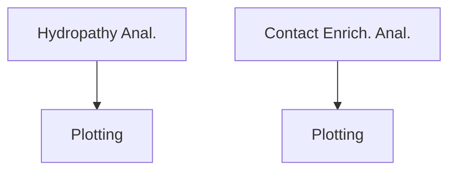

# Sequence_Complexity_and_Discrimination  

## General workflow


## Hydropathy Analysis of Loop Forming Contacts
| Class               | Amino Acid and Hydrophobicity Score |
|---------------------|-------------------------------------|
| Strong hydrophobic  | Ile 4.5 / Val 4.2 / Leu 3.8 / Phe 2.8 / Cys 2.5 / Met 1.9 / Ala 1.8 |
| Weak hydrophobic    | Gly -0.4 / Thr -0.7 / Ser -0.8 / Trp -0.9 / Tyr -1.3 / Pro -1.6     |
| Hydrophilic         | His -3.2 / Gln -3.5 / Glu -3.5 / Asn -3.5 / Asp -3.5 / Lys -3.9 / Arg -4.5 |
[Citation](https://pubmed.ncbi.nlm.nih.gov/7108955/)  

### Usage of [compare_hydropathy.py](src/data/compare_hydropathy.py)
```
usage: compare_hydropathy.py [-h] -eg ESS_GENE_LIST -neg NONESS_GENE_LIST -l LOG_FILE -c CONTACT_FILES -e UENT_FILES -o OUTPATH -t TAG

Process user specified arguments

options:
  -h, --help            show this help message and exit
  -eg ESS_GENE_LIST, --Ess_gene_list ESS_GENE_LIST
                        path to Ess gene list
  -neg NONESS_GENE_LIST, --NonEss_gene_list NONESS_GENE_LIST
                        path to Ess gene list
  -l LOG_FILE, --log_file LOG_FILE
                        Path to logging file
  -c CONTACT_FILES, --contact_files CONTACT_FILES
                        path to native contact files
  -e UENT_FILES, --uent_files UENT_FILES
                        path to unique entanglement files
  -o OUTPATH, --outpath OUTPATH
                        path to output directory. will be made if doesnt exist
  -t TAG, --tag TAG     tag for output file
```

If you have the [SLUG] then you can use the command files located [here](src/command_lists/compare_hydropathy.cmds) to reproduce loop forming contact hydropathy analysis used in this work in the experimental data set and the AlphaFold structures. Please modify any other pathing as necessary. 
  

### Usage of [Plot_hydropathy_results.py](src/data/Plot_hydropathy_results.py)
```
usage: Plot_hydropathy_results.py [-h] -f INP_FILES -o OUTPATH

Process regression data and generate plots.

options:
  -h, --help            show this help message and exit
  -f INP_FILES, --inp_files INP_FILES
                        Input file pattern for hydropathy data.
  -o OUTPATH, --outpath OUTPATH
                        Path to output directory.
```

If you have the [SLUG] then you can use the command files located [here](src/command_lists/Plot_compare_hydropathy.cmds) to reproduce the results plots for the loop forming contact hydropathy analysis used in this work in the experimental data set and the AlphaFold structures. Please modify any other pathing as necessary. 

### Results of loop forming contact hydropathy analysis
For the set of experimentally derived structures and native entanglements  
  
The raw data for these plots can be found [here](data/Hydropathy/EXP/hydropathy_results.csv)  
  
For the set of Alphafold derived structures and native entanglements  
  
The raw data for these plots can be found [here](data/Hydropathy/AF/hydropathy_results.csv)  