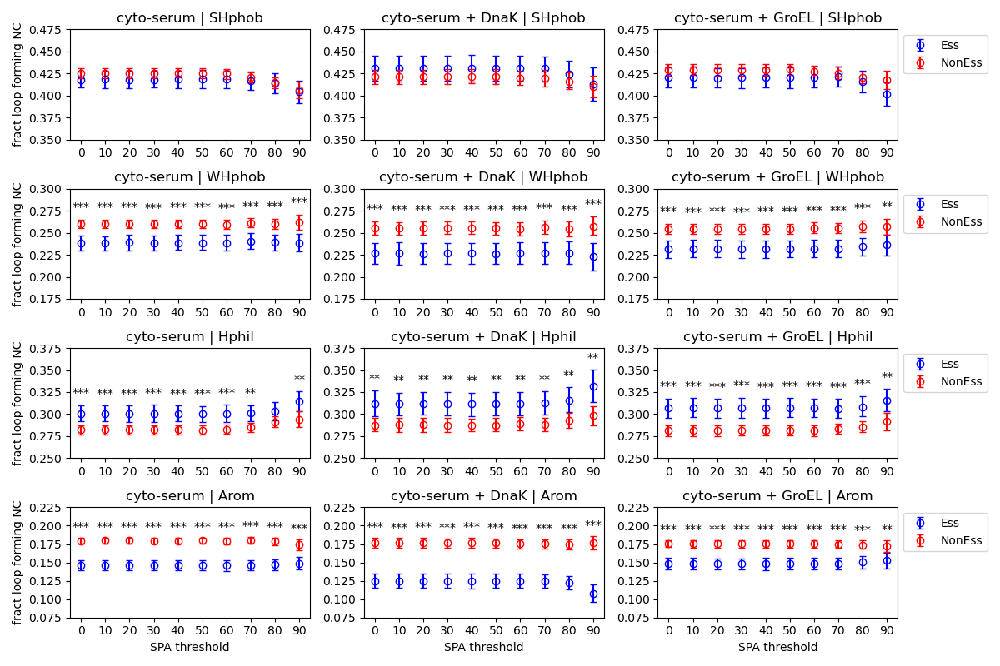
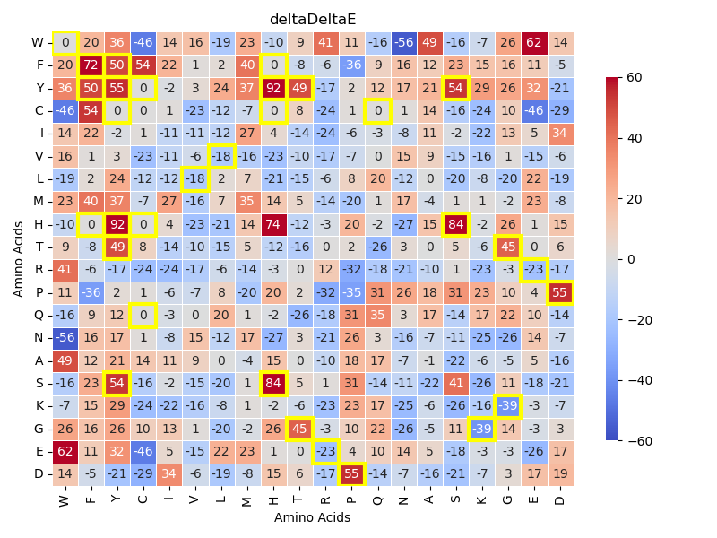

# Sequence_Complexity_and_Discrimination  

## General workflow


## Hydropathy Analysis of Loop Forming Contacts
| Class               | Amino Acid and Hydrophobicity Score |
|---------------------|-------------------------------------|
| Strong hydrophobic  | Ile 4.5 / Val 4.2 / Leu 3.8 / Phe 2.8 / Cys 2.5 / Met 1.9 / Ala 1.8 |
| Weak hydrophobic    | Gly -0.4 / Thr -0.7 / Ser -0.8 / Trp -0.9 / Tyr -1.3 / Pro -1.6     |
| Hydrophilic         | His -3.2 / Gln -3.5 / Glu -3.5 / Asn -3.5 / Asp -3.5 / Lys -3.9 / Arg -4.5 |  
  
[Citation](https://pubmed.ncbi.nlm.nih.gov/7108955/)  

### Usage of [compare_hydropathy.py](src/data/compare_hydropathy.py)
```
usage: compare_hydropathy.py [-h] -eg ESS_GENE_LIST -neg NONESS_GENE_LIST -l LOG_FILE -c CONTACT_FILES -e UENT_FILES -o OUTPATH -t TAG

Process user specified arguments

options:
  -h, --help            show this help message and exit
  -eg ESS_GENE_LIST, --Ess_gene_list ESS_GENE_LIST
                        path to Ess gene list
  -neg NONESS_GENE_LIST, --NonEss_gene_list NONESS_GENE_LIST
                        path to Ess gene list
  -l LOG_FILE, --log_file LOG_FILE
                        Path to logging file
  -c CONTACT_FILES, --contact_files CONTACT_FILES
                        path to native contact files
  -e UENT_FILES, --uent_files UENT_FILES
                        path to unique entanglement files
  -o OUTPATH, --outpath OUTPATH
                        path to output directory. will be made if doesnt exist
  -t TAG, --tag TAG     tag for output file
```

If you have the [SLUG] then you can use the command files located [here](src/command_lists/compare_hydropathy.cmds) to reproduce loop forming contact hydropathy analysis used in this work in the experimental data set and the AlphaFold structures. Please modify any other pathing as necessary. 
  

### Usage of [Plot_hydropathy_results.py](src/data/Plot_hydropathy_results.py)
```
usage: Plot_hydropathy_results.py [-h] -f INP_FILES -o OUTPATH

Process regression data and generate plots.

options:
  -h, --help            show this help message and exit
  -f INP_FILES, --inp_files INP_FILES
                        Input file pattern for hydropathy data.
  -o OUTPATH, --outpath OUTPATH
                        Path to output directory.
```

If you have the [SLUG] then you can use the command files located [here](src/command_lists/Plot_compare_hydropathy.cmds) to reproduce the results plots for the loop forming contact hydropathy analysis used in this work in the experimental data set and the AlphaFold structures. Please modify any other pathing as necessary. 

### Results of loop forming contact hydropathy analysis
For the set of experimentally derived structures and native entanglements  
  
The raw data for these plots can be found [here](data/Hydropathy/EXP/hydropathy_results.csv)  
  
For the set of Alphafold derived structures and native entanglements  
  
The raw data for these plots can be found [here](data/Hydropathy/AF/hydropathy_results.csv)  
  
  
## Loop forming contact enrichment 

### Usage of [compare_energetics_results_with_permutation.py](src/data/compare_energetics_results_with_permutation.py)
```
usage: compare_energetics_results_with_permutation.py [-h] -f FASTA_FILES -g REP_GENE_LIST -Eg ESS_GENE_LIST -NEg NONESS_GENE_LIST -l LOG_FILE -c CONTACT_FILES -r
                                                      RESFEAT_FILES -e UENT_FILES -o OUTPATH -p NUM_PERMUTE --floor FLOOR

Process user specified arguments

options:
  -h, --help            show this help message and exit
  -f FASTA_FILES, --fasta_files FASTA_FILES
                        path to fasta files for all genes in dataset
  -g REP_GENE_LIST, --rep_gene_list REP_GENE_LIST
                        path to representative gene list used in the calculation of F_ab
  -Eg ESS_GENE_LIST, --Ess_gene_list ESS_GENE_LIST
                        path to Essential gene list used for mask in Fc_ab and FcG_ab calcs
  -NEg NONESS_GENE_LIST, --NonEss_gene_list NONESS_GENE_LIST
                        path to Non-Essential gene list used for mask in Fc_ab and FcG_ab calcs
  -l LOG_FILE, --log_file LOG_FILE
                        Path to logger file
  -c CONTACT_FILES, --contact_files CONTACT_FILES
                        path to native contact files
  -r RESFEAT_FILES, --resFeat_files RESFEAT_FILES
                        path to residue Feature files
  -e UENT_FILES, --uent_files UENT_FILES
                        path to unique entanglement files
  -o OUTPATH, --outpath OUTPATH
                        path to output directory. will be made if doesnt exist
  -p NUM_PERMUTE, --num_permute NUM_PERMUTE
                        Number of permutations
  --floor FLOOR         Floor of Fc_ab contact matrix
```

If you have the [SLUG] then you can use the command files located [here](src/command_lists/compare_energetics_with_permutation.cmds) to reproduce loop forming contact enrichement analysis used in this work in the experimental data set and the AlphaFold structures. Please modify any other pathing as necessary. 
  

### Usage of [Plot_energetics_results_with_permutation.py](src/data/Plot_energetics_results_with_permutation.py)
```
usage: Plot_energetics_results_with_permutation.py [-h] -En ENORM -EsdE ESS_DELTAE -EsdEp ESS_DELTAE_PVALUES -NEsdE NONESS_DELTAE -NEsdEp NONESS_DELTAE_PVALUES -dDE
                                                   DELTADELTAE -dDEp DELTADELTAE_PVALUES -o OUTPATH -t TAG

Process regression data and generate plots.

options:
  -h, --help            show this help message and exit
  -En ENORM, --Enorm ENORM
                        path to Enorm file to plot
  -EsdE ESS_DELTAE, --Ess_deltaE ESS_DELTAE
                        path to Essential gene GT deltaE file to plot
  -EsdEp ESS_DELTAE_PVALUES, --Ess_deltaE_pvalues ESS_DELTAE_PVALUES
                        path to fdr pvalues file
  -NEsdE NONESS_DELTAE, --NonEss_deltaE NONESS_DELTAE
                        path to NonEssential gene GT deltaE file to plot
  -NEsdEp NONESS_DELTAE_PVALUES, --NonEss_deltaE_pvalues NONESS_DELTAE_PVALUES
                        path to fdr pvalues file
  -dDE DELTADELTAE, --deltaDeltaE DELTADELTAE
                        path to deltaDeltaE file to plot
  -dDEp DELTADELTAE_PVALUES, --deltaDeltaE_pvalues DELTADELTAE_PVALUES
                        path to fdr pvalues file
  -o OUTPATH, --outpath OUTPATH
                        Path to output directory.
  -t TAG, --tag TAG     tag for outfile: deltaE, Enorm,e ct....
```

If you have the [SLUG] then you can use the command files located [here](src/command_lists/Plot_compare_energetics_with_permutation.cmds) to reproduce the results plots for the loop forming contact enrichment analysis used in this work in the experimental data set and the AlphaFold structures. Please modify any other pathing as necessary. 
  
  
### Results of loop forming contact enrichment analysis
#### Experimental structures
For the cyto-serum only set of observal proteins using 100k permutations  
  
  
For the cyto-serum + Dnak only set of observal proteins using 100k permutations  
  
  
For the cyto-serum + GroEL only set of observal proteins using 100k permutations  
  
  
For the total set of proteins in the dataset using 100k permutations  
  
  

#### Alphafold structures
For the cyto-serum only set of observal proteins using 100k permutations  
  
  
For the cyto-serum + Dnak only set of observal proteins using 100k permutations  
  
  
For the cyto-serum + GroEL only set of observal proteins using 100k permutations  
  
  
For the total set of proteins in the dataset using 100k permutations  
  