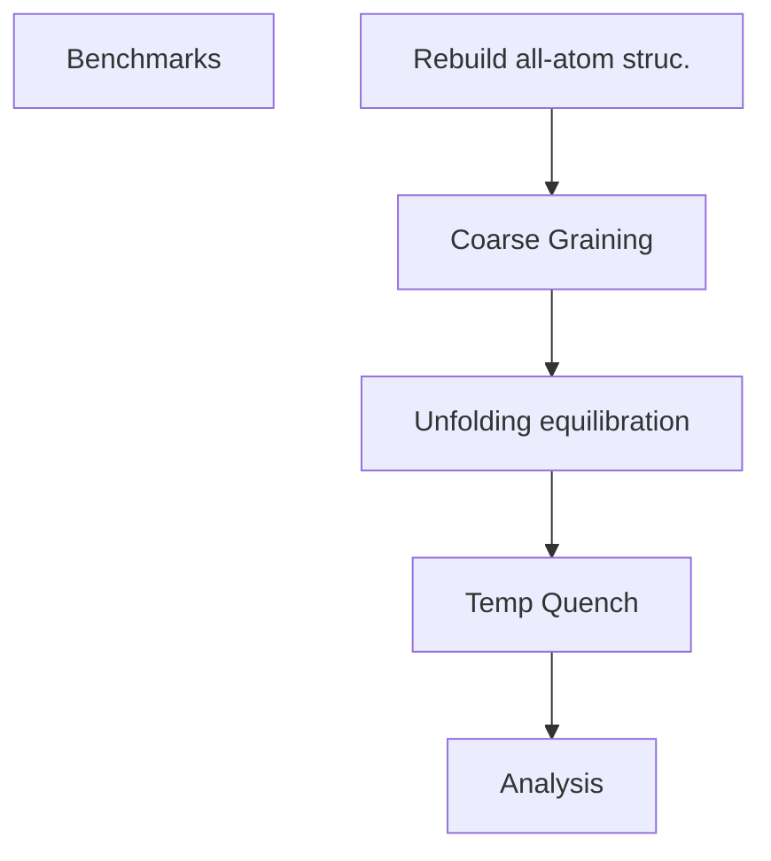

# MD simulations of Native Entanglement Misfolding
Here we preform coarse grained molecular dynamics simulations across 28 proteins to test the hypothesis that loss of entanglements are more common tha gain of entanglments when proteins misfoldin involving their native entanglements.   

## Workflow

