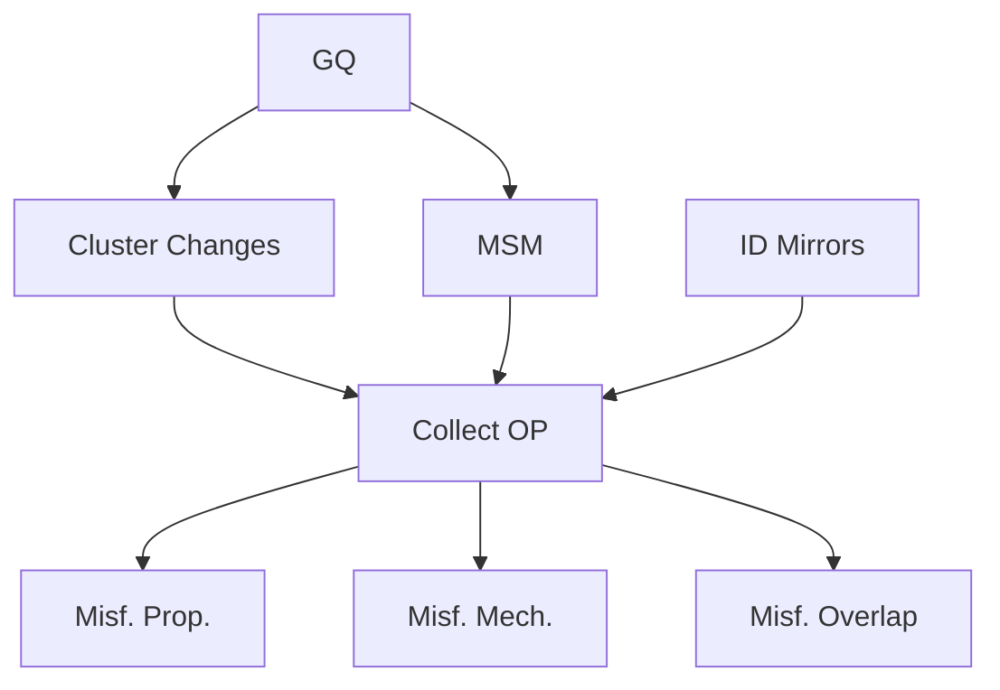

# Trajectory Analysis
## Workflow


## Fraction of native contacts (Q) <br> Fraction of native contacts with a change in entanglement (G)  
### Basic theory
#### 0. Fraction of native contacts (Q) 
The fraction of native contacts in a frame is the number of contacts relative to the number of contacts in the reference CG model derived from the crystal structure. A native contact in the reference structure is defined as follows:  
1. any two CG beads (i.e. C<sub>&alpha;</sub> sites) within 8&Aring; of eachother  
2. atleast 3 residues apart along the primary structure  
3. within secondary structures defined by [STRIDE](https://webclu.bio.wzw.tum.de/stride/).   
  
Within a frame a native contact is defined as follows:   
1. any two CG beads in contact in the reference structure  
2. the distance between them is less than 1.2\**d<sub>ref<\sub>(i,j)* where *d<sub>ref<\sub>(i,j)* is the distance between the two CG beads in the reference structure.   

#### 1. Fraction of native contacts with a change in entanglement (G)    
To detect noncovalent lasso entanglements, we use linking numbers, which requires at least one closed loop as an argument. 
We define this loop as being composed of the backbone trace connecting residues *i* and *j*, which have formed a native 
contact in the given protein conformation.

The native contact between *i* and *j* is considered to close this loop, even though there is no covalent bond between these two residues. 
Outside this loop is an N-terminal segment, composed of residues 1 through *i*-1, and a C-terminal segment composed of residues *j*+1 through *N*. 
These two segments represent open curves, whose entanglement through the closed loop we characterize with linking numbers denoted as *g<sub>N</sub>* and *g<sub>C</sub>*. 
We calculate these numbers using the partial Gauss double integration method proposed by Baiesi and co-workers.

For a given structure of an *N*-length protein, with a native contact present at residues (*i*, *j*), the coordinates *R<sub>l</sub>* 
and the gradient *dR<sub>l</sub>* of the point *l* on the curves were calculated as:

- R<sub>l</sub> = (r<sub>l</sub> + r<sub>l+1</sub>) / 2
- dR<sub>l</sub> = r<sub>l+1</sub> - r<sub>l</sub>

where *r<sub>l</sub>* is the coordinates of the Cα atom in residue *l*. The linking numbers *g<sub>N</sub>(*i*,*j*)* and *g<sub>C</sub>(*i*,*j*)* were calculated as:

$$ g_N(i, j) = \frac{1}{4\pi} \sum_{m=6}^{i-5} \sum_{n=i}^{j-1} \frac{R_m - R_n}{|R_m - R_n|^3} \cdot (dR_m \times dR_n) $$

$$ g_C(i, j) = \frac{1}{4\pi} \sum_{m=i}^{j-1} \sum_{n=j+4}^{N-6} \frac{R_m - R_n}{|R_m - R_n|^3} \cdot (dR_m \times dR_n) $$

where we excluded the first 5 residues on the N-terminal curve, last 5 residues on the C-terminal curve, and 4 residues before and after the native contact 
to eliminate the error induced by both the high flexibility and contiguity of those tails.

  
This trajectory-level analysis is useful for classifying statistically independent sample sets by the level and types of changes in entanglement they exhibit, but a time series metric which conveys the same information was desired to allow for folding time extrapolations. G is a time-dependent order parameter that reflects the extent of the topological entanglement changes in a given structure compared to the native structure. It is calculated as:

$$
G(t) = \frac{1}{N} \sum_{(i,j)} \Theta \left[(i, j) \in nc \cap g_{N|C}(i,j,t) \neq g_{native, N|C}(i,j)\right]
$$

where (i, j) is one of the native contacts in the native crystal structure; nc is the set of native contacts formed in the current structure at time t; g(i,j,t) and g_{native}(i,j) are, respectively, the total entanglement number of the native contact (i, j) at time t, and native structures estimated using previous equations; N is the total number of native contacts within the native structure and the selection function \Theta equals 1 when the condition is true and equals 0 when it is false. The larger G is, the greater the number of native contact residues that have changed their entanglement status relative to the native state. 


### Usage of [GQ.py](src/data/GQ.py)
```
usage: GQ.py [-h] --outpath OUTPATH --outname OUTNAME --psf PSF --cor COR --dcd DCD --sec_elements SEC_ELEMENTS [--start START] [--end END] [--stride STRIDE]

Process user specified arguments

options:
  -h, --help            show this help message and exit
  --outpath OUTPATH     Path to output directory
  --outname OUTNAME     base name for output files
  --psf PSF             Path to CA protein structure file
  --cor COR             Path to CA native coordinates file
  --dcd DCD             Path to trajectory to analyze
  --sec_elements SEC_ELEMENTS
                        Path to STRIDE secondary structure elements file
  --start START         First frame to analyze 0 indexed
  --end END             Last frame to analyze 0 indexed
  --stride STRIDE       Frame stride
```

#### Output files  
1. The .Q file contains the fraction of native contacts time series.  
2. The .G file contains the fraction of native contacts with a change in entanglement time series.  
3. the .EntInfo file cotnains the change in entanglement information for the time series. *(NOTE: in this file i and j and the crossings are indexed from 0 not 1)*


## Clustering of change on entanglement in CG trajectories 
It is helpful to cluster the changes in entanglement in each frame to reduce the degeneracy.  
### basic theory 
This approach relies on a combination of agglomerative density based clustering and divisive clustering. The procedure is as follows for each frame.   
1. Remove any native contacts that do not have changes in entanglement. 
2. Cluster the loop closing contacts _i_ and _j_ remaining using the DBSCAN method.  
3. For each of these loop clusters separate them into smaller clusters based on the following clustering vector  
$$v=[G_n, N_{changeType}, G_c, C_{changeType}, N_{crossings}, C_{crossings}]$$
where $G_{n|c}$ is the rounded partial linking values for the N and C terminus. $N_{changeType}$ is a string identifying the change type as Loss, Gain, LossChiral, GainChiral, and PureSwitch. Same goes for the C terminus. Finally $|N_{crossings}|$ is the number of N or C temrinal crossings.  
4. within each of these sub clusters we do one final DBSCAN clustering on the crossings.  

### Usage of [Cluster_ChangesInEnt.py](src/data/Cluster_ChangesInEnt.py)

```
usage: Cluster_ChangesInEnt.py [-h] --outpath OUTPATH --EntInfofile ENTINFOFILE --outname OUTNAME [--start START] [--end END]

Process user specified arguments

options:
  -h, --help            show this help message and exit
  --outpath OUTPATH     Path to output directory
  --EntInfofile ENTINFOFILE
                        file containing change in entanglement info from GQ.py
  --outname OUTNAME     base name for output files
  --start START         First frame to analyze 0 indexed
  --end END             Last frame to analyze 0 indexed
```

#### Output files  
1. _clustered.EntInfo file is generated for each protein candidate trajecotry with the same information as the input .EntInfo files generated by GQ.py, but also containing extra columns to define cluster IDs for each unique entanglement in each frame.   

## Building heirarchical kinetic models across quenched trajectories 
### Basic theory
#### 0. Generating microstates on the G vs. Q coordinate space

#### 1. Coarse graining metastable states  

### Usage of [BuildKineticModel.py](src/data/BuildKineticModel.py)
#### Environment setup
Please install a new Miniconda environment using the provided [MSMenvironment.yml](data/MSMenvironment.yml) file. This is required as some of the pyemma and msmtools packages have dependances on specific versions of numpy.  
```python
conda env create -f data/MSMenvironment.yml -n MSM
conda activate MSM
```

```
usage: BuildKineticModel.py [-h] --outpath OUTPATH --OPpath OPPATH --outname
                            OUTNAME --psf PSF --dcds DCDS [--start START]
                            [--end END] [--stride STRIDE]

Process user specified arguments

optional arguments:
  -h, --help         show this help message and exit
  --outpath OUTPATH  Path to output directory
  --OPpath OPPATH    Path to directory containing G and Q directories created
                     by GQ.py
  --outname OUTNAME  base name for output files
  --psf PSF          Path to CA protein structure file
  --dcds DCDS        Path to trajectories created by
  --start START      First frame to analyze 0 indexed
  --end END          Last frame to analyze 0 indexed
  --stride STRIDE    Frame stride
```

#### Output files  

## Find Mirror images
### Basic theory
The 'mirror image' conformations involve reversing the chirality of secondary structure packing against the native structure. The vectors defined by the C-alpha atoms at the start and end of the secondary structures in each structure. Chirality values of the three adjacent vectors (Eq. 1) and the K value (Eq. 2) of the mirror image are shown at the bottom. Here K = 0 because none of the chirality values is identical to the native conformation. (b) An example ‘mirror-image’ conformation found in the N-ter domain of our simulated ecPGK. The domain is color-coded from N-ter (red) to C-ter (green). The Q and K values are provided at the bottom, where K = 0.21, indicating significant chirality change in the secondary structure packing.

Chirality is assessed using the modified equation based on the one proposed by Kwiecińska & Cieplak [[1]](#1):

 &nbsp;&nbsp;&nbsp;(Eq. 1)

where ,  is the coordinates of the i-th C-alpha atom at the start or end of a secondary structure element identified in the crystal structure, and ‘sgn’ is the sign function that returns the sign of a real number. Secondary structure elements are identified for alpha-helices and beta-sheets using [Stride](http://webclu.bio.wzw.tum.de/stride/). The coordinates of start and end C-alpha atoms are pooled into a  array for all secondary structure elements and  is computed using four adjacent coordinates, resulting  values. We characterized the chirality for both native () and simulated () structures. The changes in chirality are then characterized using the order parameter K: 

 &nbsp;&nbsp;&nbsp;(Eq. 2)

where  is a step function that equals 1 when the condition is satisfied and 0 otherwise. K equals 1 when the chirality of secondary structure packing is identical to the native structure, while close to 0 indicating reversed chirality. Note that K can be very small in an unfolded structure and therefore should be considered together with the order parameter Q. 

### Usage of [calc_chirality_number.pl](src/data/calc_chirality_number.pl)
#### Environment setup

```
perl calc_chirality_number.pl
  --input | -i <INPUT.COR> for identify native contacts
  --domain | -d <DOMAIN.DAT> for domain defination
  --secs | -s <SECONDARY STRUCTURE> for secondary 
              structure defination. 
  --traj | -t <TRAJ.DCD> for simulation trajectory
  [--begin | -b] <START STEP> to split trajectory. 
                 Default is 1
  [--end | -e] <END STEP> to split trajectory. 
               Default is the end frame.
  [--outdir | -o] <DIRECTORY> for the outputs. Default is the directory
                  of your trajectories
  [--restart | -r] <0 or 1> 0: Do not restart calculation; 1: Restart 
                            calculation. Default is 0.
  [--help | -h]
```

#### Output files  
A single output file is created containing the K value for each frame of the trajectory analyzed. 
```
       D_1        D_2        1|2      total
    0.5263     0.5185     0.5306     0.5102 
    0.5789     0.4074     0.4898     0.4694 
    0.5263     0.4444     0.4694     0.5102 
    0.5263     0.6296     0.5714     0.5918 
    0.4737     0.5556     0.4898     0.4694 
    0.3684     0.4815     0.4286     0.4286 
    0.5263     0.4444     0.4490     0.4694 
    0.5263     0.4074     0.4694     0.4490 
```
Values close to 1 are native like while values closer to 0 are highly likely to be mirror images.

### Usage of [FindMirrorStructures.py](src/data/FindMirrorStructures.py)
Once G, Q, K, and the MSM model have been built you can find the trajectories that have possible mirror structures with this script. 

```
usage: FindMirrorStructures.py [-h] --outpath OUTPATH --candidates CANDIDATES --toplevel TOPLEVEL --outname OUTNAME --MirrorOutfile MIRROROUTFILE

Process user specified arguments

options:
  -h, --help            show this help message and exit
  --outpath OUTPATH     Path to output directory
  --candidates CANDIDATES
                        A file containing two columns. The candidate tag and the groupID
  --toplevel TOPLEVEL   file containing relative paths to either native state GQ files or the MSM file for various proteins
  --outname OUTNAME     base name for output files
  --MirrorOutfile MIRROROUTFILE
                        file containing trajectories identified as a mirror
```

#### Output files  
Creates a single output file that contains 1 row for each trajectory analyzed. 
```
,gene,pdb,chain,traj,<Q>,<G>,<K>,Mirror
0,P0A7N9,6XZ7,b,8,0.6953405017921147,0.00013369679053426721,0.18109527381845458,True
1,P0A7N9,6XZ7,b,40,0.6836173329046548,0.0,0.17156789197299324,True
2,P0A7N9,6XZ7,b,47,0.7004548756236678,0.0002042589855384638,0.21095273818454613,True
3,P0A7N9,6XZ7,b,48,0.6960192429059646,4.085179710769276e-05,0.18769692423105774,True
```
The script will try and intially guess mirror image trajectories based on heuristics we devised. 
If the \<K> < 0.3 it is most likely a mirror. If \<K> < 0.5 and \<G> == 0 it is also most likely a mirror. Make sure to manualy check this file and refine tha annotations by visualizing the trajectories. 

## Collect the Order Parameter data
This script collects the G, Q, and K order parameters into a single file. It also collects and collates the unique changes in entanglement resulting from the [Cluster_ChangesInEnt.py](src/data/Cluster_ChangesInEnt.py) script into a single file as well. Additionally it will identify the native states frames in each trajectory. 

### Basic theory
Native frames are defined in two ways:  
1. any frame with $$ Q \geq Q_{threshold}=\langle Q_{ref} \rangle-3\cdot\sigma_{ref}$$ $$ G \leq G_{threshold}=\langle G_{ref} \rangle-3\cdot\sigma_{ref}$$ where the threshold is defined by reference simulations at 310K. This type of native frame is called NativeByRef in all analysis to follow and in the output file. 

2. any frame in a metastable state identified in the MSM building to have the highest $\langle Q \rangle$ and lowest $\langle G \rangle$. This type of native frame is called NativeByMSS in all analysis to follow and in the output file. 

### Usage of [CollectAndProcessOP.py](src/data/CollectAndProcessOP.py)

```
usage: CollectAndProcessOP.py [-h] --outpath OUTPATH --candidates CANDIDATES --toplevel TOPLEVEL --outname OUTNAME --Mirrorfile MIRRORFILE

Process user specified arguments

options:
  -h, --help            show this help message and exit
  --outpath OUTPATH     Path to output directory
  --candidates CANDIDATES
                        A file containing two columns. The candidate tag and the groupID
  --toplevel TOPLEVEL   file containing relative paths to either native state GQ files or the MSM file for various proteins
  --outname OUTNAME     base name for output files
  --Mirrorfile MIRRORFILE
                        file containing trajectories identified as a mirror
```

#### Output files  
1. The CollectedGQK.csv file contains all the order paratmeters and native frame assignments for every frame, across every trajectory in the dataset.  
2. The CollectedEntInfo\__{gene}_\__{pdb}_\__{chain}_.csv file contains the collected unique changes of entanglement for each frame and trajectory for a given protein. This file can be quite large.  
3. The GQstats.csv file contains the statistics of the G, Q, and K order paratmeters.  

## Calculate the Fraction of Native Frames  
### Basic theory
For each trajectory the fraction of native frames is calculated and then statistics for each dataset (1 and 2) are calculated via bootstrapping for the confidence intervals about the mean and permutation for the differences in the distributions between the two datasets. The native state frames are defined in the output from [CollectAndProcessOP.py](src/data/CollectAndProcessOP.py).  

### Usage of [CompareMisfoldingPropensity.py](src/data/CompareMisfoldingPropensity.py)

```
usage: CompareMisfoldingPropensity.py [-h] --outpath OUTPATH --candidates CANDIDATES --CollectedOPpath COLLECTEDOPPATH --outname OUTNAME

Process user specified arguments

options:
  -h, --help            show this help message and exit
  --outpath OUTPATH     Path to output directory
  --candidates CANDIDATES
                        A file containing two columns. The candidate tag and the groupID
  --CollectedOPpath COLLECTEDOPPATH
                        path to the CollectAndProcessesOP DATA/ folder
  --outname OUTNAME     base name for output files
```
#### Output files  
The one and two sample statistics are generated in the DATA/ directory of the outpath. And plots are made in the Plots/ directory of the outpath. 

## Calculate the probability of various change in entanglement types
### Basic theory
For each trajectory the fraction of unique changes that were a Loss, Gain, or PureSwitch are calculated. 

### Usage of [CompareMisfoldingMechanism.py](src/data/CompareMisfoldingMechanism.py)

```
usage: CompareMisfoldingMechanism.py [-h] --outpath OUTPATH --candidates CANDIDATES --CollectedOPpath COLLECTEDOPPATH --outname OUTNAME --setID SETID

Process user specified arguments

options:
  -h, --help            show this help message and exit
  --outpath OUTPATH     Path to output directory
  --candidates CANDIDATES
                        A file containing two columns. The candidate tag and the groupID
  --CollectedOPpath COLLECTEDOPPATH
                        path to the CollectAndProcessesOP DATA/ folder
  --outname OUTNAME     base name for output files
  --setID SETID         setID to analyze (2 or 3)
```
#### Output files  
The one and two sample statistics are generated in the DATA/ directory of the outpath. And plots are made in the Plots/ directory of the outpath. 


#### References
<a id="1">[1]</a>: Kwiecińska, J. I., & Cieplak, M. (2005). Chirality and protein folding. Journal of Physics: Condensed Matter, 17(18), S1565. https://doi.org/10.1088/0953-8984/17/18/013